# Heads-Up Preflop Strategy (100bb, Button vs Big Blind)

A data-science look at heads-up no-limit hold'em preflop strategy. Stage 1 asks:
**if only all-in equity mattered, which hands should the Button raise, what size
should it open to, and what should the Big Blind 3-bet?**

## Quick start

```bash
python3 -m venv .venv && .venv/bin/pip install -r requirements.txt
.venv/bin/python -m pytest -q                 # equity engine vs known reference numbers
.venv/bin/python scripts/build_equity.py      # ~2 min -> data/ (already included)
.venv/bin/python scripts/solve.py             # ~10 s  -> output/ charts + CSVs
.venv/bin/python scripts/solve.py --open 3 --threebet 10   # try other sizes
```

## Layout

| Path | What it does |
|---|---|
| `preflop/cards.py` | 169 hand classes, 1,326 combos, 13x13 grid order |
| `preflop/equity.py` | eval7 Monte Carlo equity, equity vs random, 169x169 matrix with card removal |
| `preflop/solver.py` | BTN vs BB preflop game tree solved with CFR+ (with equity realization), EV, exploitability |
| `preflop/sizing.py` | Parallel open-size / 3-bet-size searches |
| `preflop/realization.py` | Per-hand playability bonuses (experiment 5) |
| `preflop/postflop.py` | Rule-based postflop simulator: pot-odds calling, balanced bluffing |
| `preflop/flopgame.py` | Learned flop c-bet / check-raise game (CFR+ per board texture x hand bucket) |
| `preflop/turngame.py` | Learned turn game after a c-bet is called (shared check/bet/raise tree + CFR+ loop) |
| `preflop/rivergame.py` | Learned river game after the BB check-calls the turn |
| `preflop/sizedgame.py` | Flop / turn / river with several bet sizes per street (experiment 13) |
| `scripts/solver_compare.py` | Runs TexasSolver on 12 flops and compares it with the model (experiment 14) |
| `preflop/fullgame.py` | Flop + turn + river learned together with Monte Carlo CFR, 12 hand buckets, configurable sizes (experiments 15–16) |
| `preflop/plots.py` | Range grids, heatmaps, bar and line charts |
| `scripts/` | One script per experiment (named in each section below) |
| `tests/` | Equity reference numbers, combo counts, postflop hand-strength rules |

## The model

```
BTN (SB, 0.5bb):  fold | raise to s          (never limp)
BB  (1bb):        fold | call | 3-bet to t    (t = 4s by default, 9bb vs 2.25)
BTN:              fold | call | all-in 100bb
BB:               fold | call
```

Any call goes straight to showdown and each player wins `pot x equity`.
That's the key simplification: no postflop betting, and position is worth nothing.
CFR+ finds the Nash equilibrium of this game. Exploitability is under 0.1 milli-bb
per hand, so the strategies are effectively exact *for this model*.

## Stage 1 results

| Open | BTN EV (bb/hand) | BTN raises | BB folds | BB calls | BB 3-bets |
|---|---|---|---|---|---|
| 2.0 | -0.119 | 68% | 0% | 79% | 21% |
| **2.25** | **-0.108** | **65%** | **0%** | **81%** | **19%** |
| 2.5 | -0.097 | 63% | 0% | 82% | 18% |
| 3.0 | -0.078 | 60% | 14% | 69% | 17% |
| 3.5 | -0.074 | 58% | 29% | 55% | 16% |
| 4.0 | -0.079 | 57% | 41% | 45% | 14% |

* **BTN at 2.25bb raises 65%** and folds weak offsuit hands and low unconnected
  suited hands (T2s, 9xs-and-below gappers, 87o, 76o...).
* **BB 3-bets ~19%**: pairs 22+, Ax down to A7o / A2s, KQ/KJ/KTs, plus suited
  connectors T9s/98s/87s. **BB never folds** to a 2.25bb open, because even 32o has
  about 32% equity and only needs 28% to call.
* **The equity-only model picks ~3.5bb as the best open, not 2.25bb.** Small opens
  give the BB a great price to see every flop, and nothing here punishes the BB
  for being out of position. Solvers that model postflop play favour 2–2.5bb, so
  the gap is a measure of how much postflop play and position matter. That is
  stage 2.

## Experiment 2: Big Blind defense vs a 2.25–2.50bb open

`scripts/bb_defense.py` (~6 min) solves every BTN open from 2.25 to 2.50bb in
0.05bb steps and tries every BB 3-bet size from 6 to 14bb (0.25bb steps), keeping
the one that earns the BB the most. It runs two models:

* **equity**: raw all-in equity, position is worth nothing.
* **position**: in pots that see a flop, the BTN realizes 110% of its equity and
  the BB 85% (`r_ip`, `r_oop` in `solve()`). These two numbers are illustrative
  assumptions, not measured.

| BTN open | Best 3-bet (equity) | Best 3-bet (position) | BB fold / call / 3-bet (position) |
|---|---|---|---|
| 2.25 | 8.0bb (3.6x) | 10.0bb (4.4x) | 5% / 77% / 18% |
| 2.30 | 8.0bb | 10.5bb | 6% / 76% / 18% |
| 2.35 | 8.25bb | 10.75bb | 9% / 73% / 18% |
| 2.40 | 8.5bb | 11.25bb | 10% / 73% / 17% |
| 2.45 | 8.5bb | 11.5bb | 10% / 73% / 17% |
| 2.50 | 8.75bb (3.5x) | 11.5bb (4.6x) | 13% / 70% / 17% |

* **The best 3-bet scales with the open: about 3.5x in the equity model and about 4.5x
  once the BB is penalized for being out of position.** Playing a bloated pot out of
  position is costly, so the BB 3-bets bigger to make the BTN fold more often
  (the BTN folds ~45% to the 3-bet at every size).
* **The EV curves are flat near the top.** Anything within about ±0.75bb of the
  best size costs under 1 milli-bb per hand (see `good_3bet_range_bb` in `summary.csv`).
* **The 3-bet range barely moves across 2.25–2.50.** It's a linear "value" range:
  pairs 55+, Ax suited down to A4s, offsuit aces down to A7o, broadway hands.
  What changes is the **fold** range. With the position penalty, the BB folds 5%
  vs 2.25bb and 13% vs 2.50bb: every 0.05bb on the open pushes the weakest
  offsuit hands (83o, 74o, 64o, 53o, 43o...) from call to fold.

Outputs in `output/bb_defense/`: `summary.csv`, `bb_ranges.csv` (every hand,
every size, both models), `ev_by_3bet_size.csv`, and range / EV charts.

## Experiment 3: Sweeping the BB's out-of-position penalty

Only the ratio `r_ip / r_oop` changes the results, so `scripts/realization_sweep.py`
fixes the BTN at 1.0 and sweeps the BB's `r_oop` from 0.75 to 1.0. Experiment 2's
1.10 / 0.85 "position model" is r_oop ≈ 0.77 on this scale.


| r_oop | Best 3-bet vs 2.25 | BB fold vs 2.25 | Best 3-bet vs 2.50 | BB fold vs 2.50 |
|---|---|---|---|---|
| 1.00 | 8.0bb (3.6x) | 0% | 8.75bb (3.5x) | 0% |
| 0.90 | 8.75bb (3.9x) | 0% | 9.75bb (3.9x) | 5% |
| 0.80 | 9.75bb (4.3x) | 4% | 11.0bb (4.4x) | 11% |
| 0.75 | 10.5bb (4.7x) | 5% | 11.75bb (4.7x) | 15% |

* **The best 3-bet size grows almost linearly as the penalty grows**, from about 3.5x
  the open with no penalty to about 4.7x at r_oop 0.75.
* **Folding starts only once the penalty is real.** Against 2.25bb the BB keeps
  defending everything until r_oop drops below ~0.86. Against 2.50bb, folds start
  at ~0.97.
* **The 3-bet frequency falls slightly** (20% → 17%): a bigger size means a tighter range.
  The jagged lines come from the 0.25bb size grid.

## Experiment 4: The Button chooses its open size too

`scripts/sizing_game.py` lets the Button choose an open from 2.0 to 4.0bb, knowing the
BB will answer with its best 3-bet size (2.5x–6x the open). Each player uses one size
for every hand.


| r_oop | BTN best open | BB 3-bets to | BTN raises | BB fold / call / 3-bet | Cost of opening 2.2bb |
|---|---|---|---|---|---|
| 1.00 | 3.4bb | 11.9bb (3.5x) | 58% | 25% / 59% / 17% | 3.7bb/100 |
| 0.90 | 3.2bb | 12.4bb (3.9x) | 67% | 28% / 56% / 17% | 3.4bb/100 |
| 0.80 | 3.1bb | 14.3bb (4.6x) | 79% | 29% / 55% / 17% | 3.1bb/100 |
| 0.75 | 3.1bb | 15.5bb (5.0x) | 86% | 29% / 55% / 16% | 3.3bb/100 |

* **The Button's best open stays at 3.1–3.4bb whatever the penalty.** Penalizing the BB
  makes the Button profitable and lets it open far more hands (58% → 86%), but the best
  size only drops from 3.4 to 3.1bb.
* **So this model still can't produce 2.25bb opens.** Small opens are what solvers that
  play the full game recommend. The model is missing whatever makes small opens work:
  postflop betting, hand-by-hand realization (suited/connected hands realize more), and
  mixing sizes by hand.
* **The BB's answer to a bigger open is a bigger 3-bet**, reaching 5x the open at r_oop 0.75.

## Experiment 5: Hand-by-hand realization — where 2.25bb appears

`scripts/hand_realization.py` adds two kinds of per-hand realization on top of the
BB's position penalty (r_oop = 0.85), then reruns the open-size game (opens
1.75–3.5bb every 0.05bb, BB best-responds with its 3-bet size):

* **Playability (k):** suited, connected and broadway hands realize more
  (`preflop/realization.py`, hand-picked bonuses).
* **Strength (alpha):** the BTN's pot share becomes `E^a / (E^a + 0.85 (1-E)^a)`.
  With a > 1, strong hands realize more than their equity and weak hands less,
  because after the flop strong hands win bigger pots and weak hands fold. At a = 1.5,
  a 30%-equity hand realizes about 73% of its equity and a 60% hand about 108%.


| Model | BTN best open | Opens within 1 mbb of best | Cost of 2.25 (bb/100) | BB 3-bet vs 2.25 |
|---|---|---|---|---|
| position only | 3.10bb | 2.95–3.25 | 2.84 | 9.6bb |
| playability k=2 | 3.25bb | 3.05–3.40 | 2.79 | 9.0bb |
| strength a=1.25 | 2.65bb | 2.50–2.80 | 0.78 | 7.9bb |
| strength a=1.4 | 2.45bb | 2.35–2.60 | 0.20 | 7.3bb |
| **strength a=1.5** | **2.35bb** | **2.25–2.50** | **0.06** | **7.3bb** |
| **strength a=1.6** | **2.25bb** | **2.15–2.35** | **0.00** | **6.75bb** |
| strength a=1.75 | 2.10bb | 2.00–2.25 | 0.09 | 6.75bb |
| strength a=2.0 | 1.95bb | 1.85–2.05 | 0.44 | 6.2bb |
| both a=1.5 k=2 | 2.40bb | 2.25–2.50 | 0.09 | 7.3bb |

* **Playability bonuses don't explain small opens.** They help both players' good
  hands, so they mostly cancel out, and the best open stays above 3bb.
* **The strength effect does.** At a ≈ 1.5–1.6, a 2.25bb open is the best size (or
  within 0.06bb/100 of it). The more postflop play rewards strong hands and punishes
  weak ones, the smaller the best open: a smoothly falling curve from 3.1bb to 1.95bb.
* **Why:** a small open gets called by many weak BB hands that will underperform
  after the flop. The BTN *wants* those calls, so it keeps the price low.
* At a = 1.5 vs a 2.25bb open, the BTN raises 71%. The BB folds 26%, calls 53%,
  and 3-bets 21% to ~7.3bb (about 3.25x), a smaller 3-bet than in the equity-only models.

Caveat: alpha is a single knob chosen to match a known answer, not fitted to
data. Calibrating it against real solver EVs is the next step.

## Experiment 6: Calibrating realization, then measuring it by simulation

### 6a. Calibration to published solver numbers (`scripts/calibrate.py`)

Targets for the BB vs a ~2.5bb open at 100bb, from the
[Preflop Wizard heads-up guide](https://www.preflopwizard.app/blog/poker-heads-up-strategy):
fold 30–35%, 3-bet 15–20%, 3-bet size 9–10bb. This is a weak source: an aggregate of
unnamed solver runs that include limping, which this model doesn't allow.

A grid search over α (1.0–2.0) and r_oop (0.70–1.00) finds **α = 1.4, r_oop = 0.75**
fits every target (fold 31%, 3-bet 21% to 9bb). α is well pinned down (1.3–1.5);
r_oop less so (0.70–0.80 all fit).


**Out-of-sample check:** the open size was not a target, yet the calibrated model's
best BTN open is **2.45bb** (2.35–2.6 within 1 milli-bb), inside the 2–2.5bb that
solvers use. Opening 2.25bb instead costs only 0.19bb/100.

### 6b. Measuring realization with simple postflop rules (`scripts/simulate_realization.py`)

`preflop/postflop.py` plays hands out from the flop. Both players follow the same rules:

| Strength (from the cards each player sees) | First to act / checked to | Facing a bet |
|---|---|---|
| **Strong**: two pair+ that improves the board, overpair, top pair with T+ kicker | bet 2/3 pot | call |
| **Medium**: any other pair using a hole card, or a flush draw / open-ended straight draw (not on the river) | check | call |
| **Weak**: everything else | bluff 1/3 of the time, else check | fold |

The BB acts first every street; one bet per street at most and no raises. Hands are dealt
from the model's BTN opening range vs BB calling range at a 2.25bb open, 1.4M hands
per round. Then α and r_oop are fitted to the results, the preflop game is re-solved
with them, and the loop repeats until they stop moving (2 rounds).

| | α | r_oop | BTN best open |
|---|---|---|---|
| Calibrated to solver numbers (6a) | 1.40 | 0.75 | 2.45bb |
| **Simulated from simple rules (6b)** | **1.36** | **0.80** | **2.45bb** (2.35–2.65) |

On average the BTN wins 63% of the flop pot with 55% equity.


Per-hand realization (realized share ÷ raw equity):

* **BTN (in position):** big pairs realize the most (AA 2.7x, KK 2.3x, small pairs ~1.4x,
  because the rules pay them off with any pair). Suited connectors 1.3–1.4x.
  Offsuit weak aces and kings only 0.8–0.9x.
* **BB (out of position):** offsuit trash (A2o–A5o, K2o–K6o, Q2o–Q6o) realizes only
  ~0.6–0.7 of its equity; suited connectors and broadway offsuit ~1.0–1.2.


### 6c. How much do the rules matter? (`scripts/rule_sensitivity.py`)

| Rules | α | r_oop | BTN best open |
|---|---|---|---|
| baseline (bluff 1/3, bet 2/3 pot) | 1.35 | 0.78 | 2.50bb |
| never bluff | 1.70 | 0.95 | 2.25bb |
| bluff 2/3 of the time | 1.60 | 0.54 | 2.70bb |
| bet 1/2 pot | 1.05 | 0.89 | 3.10bb |
| bet full pot | 2.12 | 0.50* | 2.10bb |

\* hits the edge of the fit grid.

**Bet size is the biggest driver.** The rules call with any pair whatever the bet size,
so bigger bets just extract more from strong hands, making α larger and the best open
smaller. That the 2/3-pot baseline matches the solver calibration is encouraging,
but partly luck of the rule choice. The obvious next step is calling based on pot odds.

### 6d. Pot-odds calling and balanced bluffing

The 6b rules had two flaws: medium hands called any bet regardless of price, and
bettors bluffed a fixed 1/3 of their weak hands. `preflop/postflop.py` now defaults to:

* **Pot-odds calling:** facing a bet, call if your chance of beating the *bettor* is at least
  `bet / (pot + 2·bet)` (28.6% vs 2/3 pot). Strong hands always call. The chance comes from a
  learned table: hand strength (equity vs a random hand on this board, eval7 Monte Carlo)
  → how often hands that strong actually beat a bettor on that street. Example: on the river,
  a hand that beats 70% of random hands beats a bettor only ~30% of the time.
* **Balanced bluffing:** in each spot (BB leading / BTN after a check, by street), weak hands bluff
  just often enough that bluffs are `bet / (pot + 2·bet)` of all bets, the mix that leaves a
  caller indifferent. Learned rates are 4–9% of weak hands on the flop and 16–18% on the river.

Both are learned from two warm-up batches before the main batch.
(Pot-odds calling with the old fixed 1/3 bluffing ran away to α ≈ 2.9: callers adapt but
bettors don't, and the BTN gets more bluffing spots.)

| Rules | α | r_oop | BTN realizes / equity | BTN best open |
|---|---|---|---|---|
| **pot odds + balanced, 2/3 pot** | **1.25** | **0.92** | 62% / 58% | **2.75bb** (2.6–2.85) |
| pot odds + balanced, 1/2 pot | 1.13 | 0.93 | 61% / 58% | 3.00bb |
| pot odds + balanced, full pot | 1.66 | 0.88 | 67% / 58% | 2.25bb |
| pot odds + fixed bluff 1/3 | 2.91 | 0.69 | 80% / 58% | 1.75bb |
| old rules (call any pair, bluff 1/3) | 1.45 | 0.85 | 67% / 58% | 2.40bb |

Smarter rules give a smaller α (1.25) and a less extreme position penalty, so the best
open moves up to ~2.75bb, and 2.25bb costs 1.0bb/100. Bet size still matters, but less
(open 2.25–3.0bb across 1/2–full pot, vs 2.1–3.1bb with the old rules).

## Experiment 7: The Big Blind vs different raise sizes, preflop and postflop

`scripts/bb_study.py`. For each BTN open (2.0–3.5bb), realization is re-measured *at that
size* (solve → simulate with pot-odds / balanced rules → refit, 2 rounds), then the BB's
preflop and postflop play is summarized. α stays 1.26–1.36 at every size, so in this
range the open size barely changes how well hands realize.

### Preflop


| BTN open | BB fold | call | 3-bet (to) | Fold limit (1 − MDF) |
|---|---|---|---|---|
| 2.0 | 2% | 74% | 23% (6.5bb) | 50% |
| 2.25 | 10% | 69% | 21% (7.3bb) | 54% |
| 2.5 | 24% | 55% | 20% (8.1bb) | 57% |
| 2.75 | 31% | 50% | 19% (9.6bb) | 60% |
| 3.0 | 39% | 42% | 19% (9.75bb) | 63% |
| 3.5 | 47% | 35% | 18% (11.4bb) | 67% |

* **Raise size mostly changes the BB's folds, not its 3-bets.** Each +0.25bb on the open moves
  ~5–10% of hands from call to fold, while the 3-bet share drifts only from 23% to 18%.
* **The best 3-bet stays ~3.25x the open** at every size.
* **The BB always defends more than MDF requires** (MDF = 1.5 / (open + 1): the BTN risks
  open − 0.5 to win 1.5). Calling has real value because the BB's hand still realizes ~90%
  of its equity out of position.
* Vs 2.25bb the BB folds only 11 hands (72o, 93o, 83o-style trash). Vs 3.0bb it folds most
  weak offsuit hands and low suited gappers (T2s–T4s, 92s–95s, 82s–85s, 72s–74s, 62s–64s, 52s–54s).


### Postflop (BB-called pots, simulated)


* **The BB realizes ~90% of its equity** (0.89–0.91) at every open size.
* **Called pots end the same way regardless of open size:** BB folds ~25%, BTN folds 17–21%,
  showdown 54–58%.
* **The BB leads more as the open grows** (flop leads 8% → 12%). Its calling range is tighter and
  stronger, so it flops more strong hands. River leads are steady at ~21%.
* **The BB folds 55–75% when the BTN bets.** That's correct against these rules: a balanced
  BTN betting range is ~71% value, so folding weak hands is right. Real players c-bet much
  more widely, so the BB should fold less.
* **BB bluffs work 54–61% of the time** (more often vs bigger opens).
* **Calling beats folding by +0.44 to +0.56bb per called hand.** The BB loses ~0.5bb on
  average postflop, but folding loses 1bb.


Per hand (vs 2.25bb): **broadway offsuit hands are the most profitable calls** (QJo +1.8, KTo +1.8,
QTo +1.5) along with high suited hands (K9s +1.4, Q9s +1.2). Weak offsuit hands barely break
even (T5o +0.02, T3o −0.01, J2o −0.03, T2o −0.16): those are the next folds as the open grows.
Vs 3.0bb the worst calls (Q2o −0.21, J5o −0.08, K2o −0.03) are already losing.

## Experiment 8: If the BB always checks, what does the Button c-bet, and when should the BB check-raise?

`scripts/cbet_study.py` + `preflop/flopgame.py`. BTN opens 2.25bb, BB calls (ranges from the
preflop solver). On the flop:

```
BB:  always checks
BTN: check | c-bet 1/3 pot
BB:  fold | call | check-raise to 3x the c-bet
BTN: fold | call                      (after a check-raise)
```

Turn and river use the pot-odds / balanced rules. **No flop decision is hand-written.** Each is
learned per (board texture, hand bucket) with CFR+ and Monte Carlo rollouts: every hand's flop
lines are all played to the end, the value of each option is averaged per texture × bucket, and
options that would have done better get played more next round (60 rounds, then 800k hands).

* **Hand buckets:** two pair+, overpair, top pair T+ kicker, top pair weak kicker, weaker pair,
  draw (flush draw / open-ender), two overcards, air.
* **Board texture:** high card (A / K / Q-J / T-or-lower) × paired × suits (rainbow / two-tone /
  monotone) × connected (three ranks within a 5-card span).

### Overall

| BTN c-bets | BB folds / calls / check-raises vs a c-bet | BTN calls a check-raise |
|---|---|---|
| 58% of flops | 32% / 50% / 18% | 80% |

### The Button's c-bet range


* **Value and draws always bet:** two pair+ 99%, draws 96%, overpairs 80%, top pair 78–81%.
* **Weak pairs mostly check** (44%), keeping the pot small with showdown value.
* **Air bets half the time overall, but it depends on the board.** 77% on A-high flops, 62% K-high,
  51% Q/J-high, only 13% on T-high-or-lower. High boards favor the BTN's range (it has more
  big cards after raising preflop); low, connected boards favor the BB's wider calling range.
* **By texture:** c-bets 85% on A-high flops vs 43% on T-high-or-lower; 46% on connected
  boards and 44% on monotone boards vs ~60% elsewhere.


### When should the BB check-raise?


* **By hand:** two pair+ 97% (value), draws 81% (semi-bluff), top pair T+ kicker 67%, top pair
  weak kicker 31%. Weaker pairs and overcards mostly *call* (86% / 80%). Air folds 51% and
  check-raises as a bluff 7%.
* **By board, the BB check-raises most on boards that favor it:**
  * paired boards 27% vs 17% unpaired
  * T-high-or-lower 22% vs A-high 15%
  * top textures: paired low/middle boards and low connected boards (26–31%)
* **It check-raises least on A-high boards** (12–14%), where the BTN's range is strongest.
* **Texture changes which hands raise:**
  * top pair T+ kicker raises 80% on disconnected boards but only 22% on connected ones
    (too many better hands and draws around)
  * draws raise 94% on two-tone boards but only 20% on monotone ones (a flush draw on a
    monotone board is weaker)
  * air bluff-raises more on paired boards (18% vs 5%)


## Experiment 9: The BB study with a Button that bets more

`python scripts/bb_study.py cbet` reruns experiment 7 with the learned flop from experiment 8:
the BB checks the flop, and the BTN's c-bets and the BB's fold / call / check-raise are
learned at every open size (~18 min on an idle machine; each size is saved as it finishes).

### Preflop


| BTN open | BB fold / call / 3-bet (BTN bets more) | rules-only BTN (exp. 7) | 3-bet to | BB realization (exp. 7) |
|---|---|---|---|---|
| 2.0 | 10% / 68% / 22% | 2% / 74% / 23% | 7.0bb (3.5x) | 0.82 (0.89) |
| 2.25 | 22% / 58% / 21% | 10% / 69% / 21% | 7.9bb (3.5x) | 0.83 (0.90) |
| 2.5 | 31% / 49% / 20% | 24% / 55% / 20% | 8.75bb (3.5x) | 0.83 (0.90) |
| 2.75 | 36% / 45% / 20% | 31% / 50% / 19% | 10.3bb (3.75x) | 0.83 (0.90) |
| 3.0 | 38% / 44% / 18% | 39% / 42% / 19% | 11.25bb (3.75x) | 0.84 (0.90) |
| 3.5 | 46% / 36% / 18% | 47% / 35% / 18% | 13.1bb (3.75x) | 0.85 (0.91) |

* **A Button that c-bets often cuts the BB's realization from ~0.90 to ~0.83** (α ≈ 1.35, r_oop 0.74–0.81).
* **The BB should fold more vs small opens:** +8 to +12 percentage points at 2.0–2.25bb. The gap
  closes by 3.0bb, where the BB's calling range is already tight.
* **The BB 3-bets bigger:** ~3.5–3.75x the open instead of ~3.25x. Taking the pot preflop is
  worth more when calling means facing frequent c-bets out of position.
* **The 3-bet share is unchanged** (22% → 18% as the open grows), and the BB still defends
  more than MDF at every size.
* **Calling still beats folding** by +0.43 to +0.49bb per called hand.

### Postflop


| BTN open | BTN c-bets | BB fold / call / check-raise vs c-bet | BTN calls a check-raise |
|---|---|---|---|
| 2.0 | 54% | 33% / 43% / 24% | 83% |
| 2.25 | 53% | 30% / 46% / 24% | 82% |
| 2.5 | 50% | 29% / 49% / 23% | 84% |
| 2.75 | 48% | 28% / 49% / 24% | 81% |
| 3.0 | 46% | 29% / 47% / 24% | 81% |
| 3.5 | 44% | 28% / 48% / 25% | 82% |

* **The bigger the open, the less the BTN c-bets** (54% → 44%). The BB's calling range gets
  tighter and stronger, so fewer flops favor the BTN.
* **The BB's answer to a c-bet barely depends on the open:** fold ~28–33%, check-raise ~24%.
  It folds slightly less vs bigger opens, because its range is stronger.
* **Called pots:** BB folds ~28–33%, BTN folds ~17%, showdown ~51–54%. That's more BB folds and
  fewer showdowns than with the rules-only BTN.


## Experiment 10: A Button that c-bets 75% on its boards and 50% on the BB's

`scripts/cbet_frequency_test.py`, 2.25bb open.

**Which boards favor whom:** for each flop texture, the BTN's average equity vs the BB's calling
range (measured from the simulated showdowns). The BTN averages 58%; textures above that
favor the BTN (46% of flops). A-high and K-high boards favor the BTN (61–64%). T-high-or-lower
unpaired boards favor the BB (52–55%), especially connected ones.

**The fixed strategy:** c-bet exactly 75% on BTN boards and 50% on BB boards, filling the frequency
in priority order: two pair+, overpair, top pair, then draws, then air (bluffs), then two
overcards, with weak pairs checking last. The BB (and the BTN's answer to a check-raise) learn
their best response.

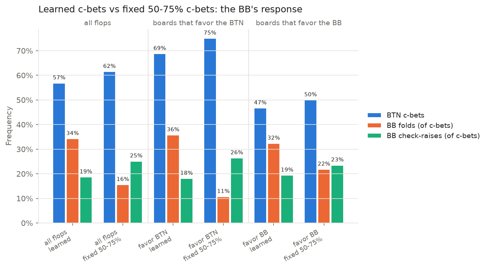

| | BTN c-bets | BB fold / call / check-raise vs c-bet | BTN EV from the flop (bb/hand) |
|---|---|---|---|
| learned c-bets | 57% (69% BTN boards, 47% BB boards) | 34% / 47% / 19% | 0.705 |
| fixed 50–75% | 62% (75% / 50%) | 16% / 59% / 25% | 0.643 |

* **The learned BTN already c-bets ~69% / 47% by board.** The 50–75% rule gets the frequencies
  roughly right.
* **It still loses 0.06bb per flop, because of *which* hands bet.** The rule always bets top pair
  and draws, bluffs 78% of its air, and checks nearly all weak pairs and overcards. That betting
  range is polarized and bluff-heavy, so the BB stops folding: it **calls air 62% of the time**
  (36% vs the learned BTN), folds only 16% overall, and check-raises more (25%), especially
  with weak top pairs (44% vs 31%).
* **Lesson:** a good c-bet frequency is not enough. The hands inside it have to be balanced. The
  learned BTN mixes in some weak pairs and overcards and checks back some air.

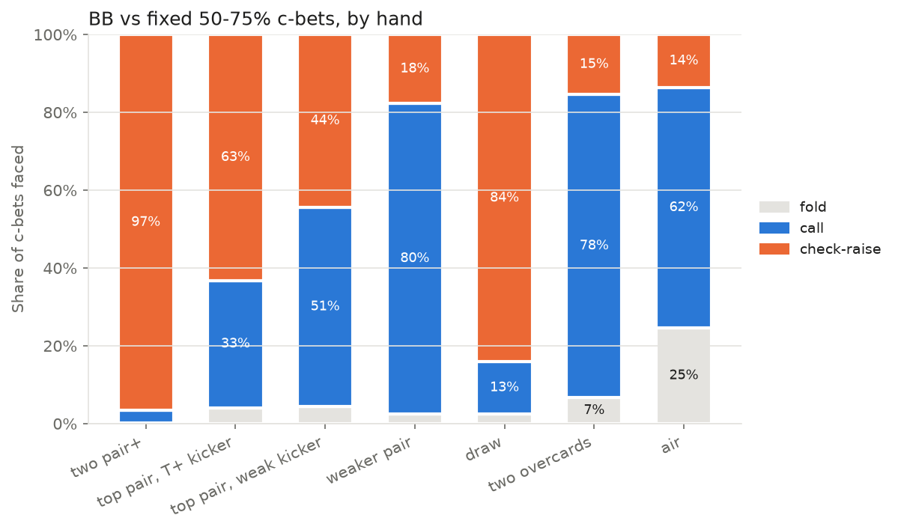

## Experiment 11: The BB called the c-bet. What now on the turn?

`scripts/turn_study.py` + `preflop/turngame.py`. After a flop c-bet and BB call, the turn is a
learned game:

```
BB:  check | lead 2/3 pot
 after a check:  BTN check | bet 2/3 pot  ->  BB fold | call | check-raise 3x  ->  BTN fold | call
 after a lead:   BTN fold | call | raise 3x  ->  BB fold | call
```

* **Inputs:** hands are weighted by how likely the flop c-bet and call were under each flop
  strategy from experiment 10. The river uses the rules.
* **Turn texture:** what the turn card did (blank / overcard / pairs the board / flush card /
  straight card) × dry or wet flop.
* **Learning:** decisions are learned with CFR+ per texture × hand bucket (40 rounds, then
  800k hands), with fixed seeds, so reruns give identical numbers.

What the BB holds on the turn after calling a learned c-bet: weaker pairs 42%, air 35% (floats
that missed), two pair+ 7%, top pair 8%, draws 7%.

### The BB's turn strategy (after learned flop c-bets)

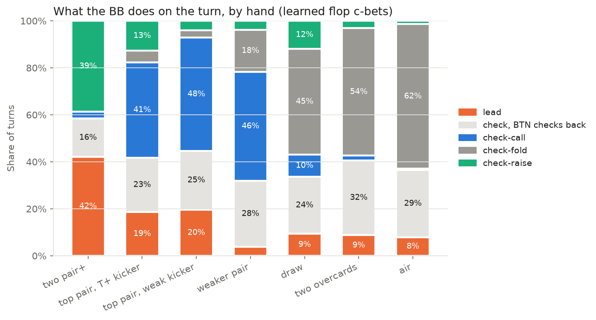

| BB hand | Leads | vs a BTN bet: fold / call / check-raise |
|---|---|---|
| two pair+ | 42% | 0% / 7% / 93% |
| top pair, T+ kicker | 19% | 8% / 70% / 22% |
| top pair, weak kicker | 20% | 6% / 87% / 7% |
| weaker pair | 4% | 26% / 68% / 6% |
| draw | 9% | 68% / 14% / 18% |
| two overcards | 9% | 91% / 3% / 5% |
| air | 8% | 97% / 1% / 2% |

* **Mostly check.** The BB leads only 9% of turns; the BTN bets 70% when checked to.
* **Strong hands:** two pair+ splits between leading (42%) and check-raising (93% of the times
  it checks and faces a bet).
* **Pairs check-call.** Top pair calls 70–87%, weaker pairs 68%.
* **Draws mostly fold to a 2/3-pot bet (68%).** One card to come gives ~18–20% equity vs the
  28.6% needed, and the river rules pay off little extra, so there are few implied odds.
  Some draws check-raise as semi-bluffs (18%).
* **Air and overcards give up** (91–97% fold); air bluff-leads 8%.

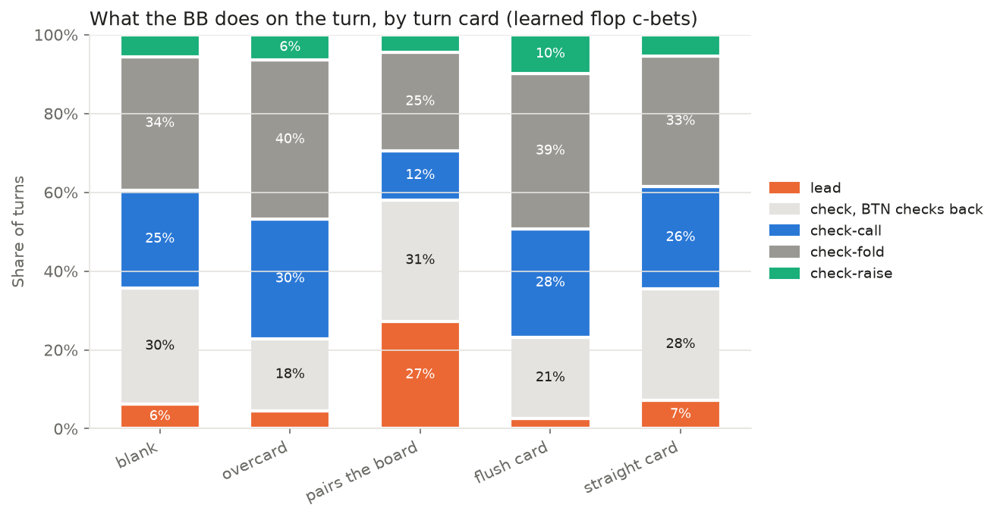

**By turn card:**

* **Board pairs: the BB leads 27%** (vs 3–7% on other turns): two pair+ leads 71% and weak top
  pairs 79%. Turns that pair the board help the BB's range, which is full of middling pairs.
  The BTN bets less (58%), and the BB folds more when it does bet (60%).
* **Flush-completing turns:** the BB almost never leads (3%) but check-raises the most (13%).
  Draws fold 78% (their remaining draw is usually weaker once three suited cards are out), and
  weaker pairs fold more (36%).
* **Overcard turns:** the BTN bets the most (81%), since overcards hit its preflop-raising range;
  the BB leads only 5%.
* **Blank and straight-completing turns sit in between.** Straight cards give the BB's draws the
  most check-raises (22%).
* **Dry vs wet flop:** on dry flops draws fold far less (23% vs 76%) and check-raise 49%. The few
  draws there are usually strong (open-enders with overcards).

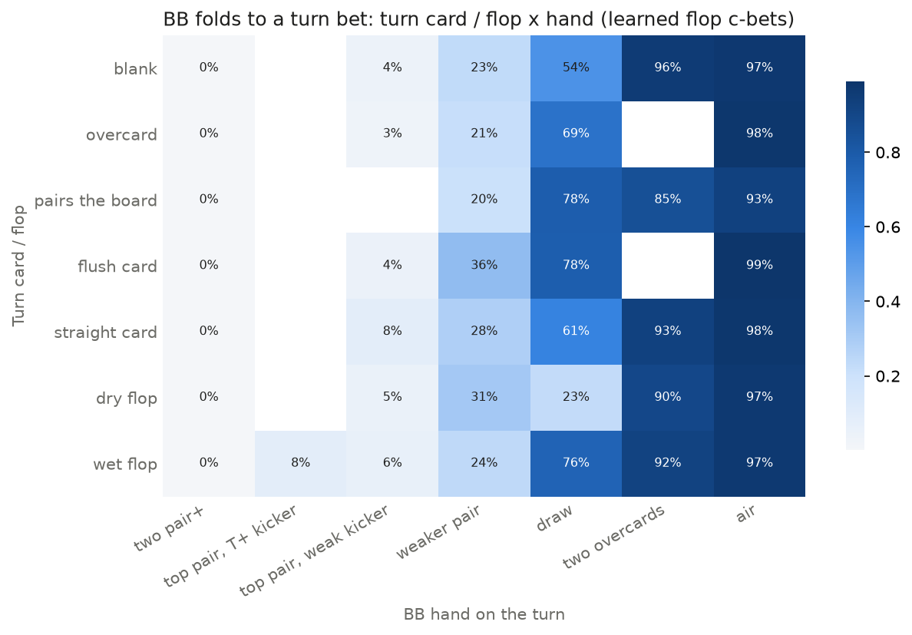

### After the fixed 50–75% flop c-bets

The BB arrives on the turn with more air (47% of hands, from floating the bluff-heavy c-bets)
and its turn strategy shifts:

* **Weaker pairs and draws defend more vs a turn bet:** pairs fold 14% (vs 26%); draws fold 37%
  (vs 68%) and call 45%. The BTN's turn betting range is weaker, carrying air from the flop.
* **More check-raises with top pair** (31% / 18% for strong / weak kicker, vs 22% / 7%) and on
  board-pairing turns (18% vs 11%).
* **Fewer leads on board-pairing turns** (14% vs 27%).

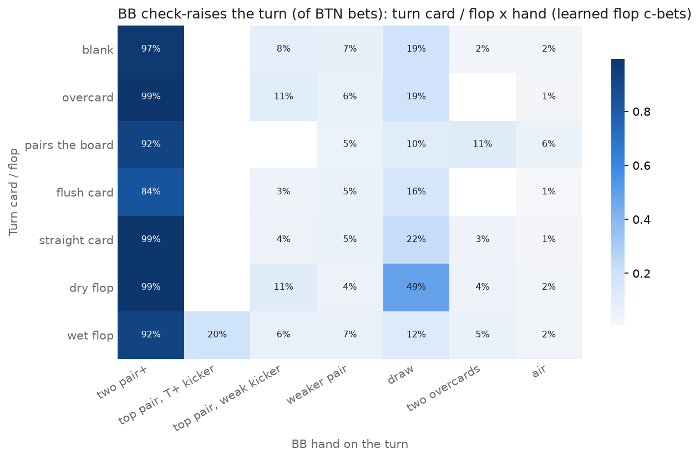

## Experiment 12: The BB called the turn too. What now on the river?

`scripts/river_study.py` + `preflop/rivergame.py`. The line: BTN c-bets the flop, BB calls; BB checks
the turn, BTN bets 2/3 pot, BB calls. The river uses the same learned tree as the turn (check / lead,
bet, fold / call / check-raise, raises; 2/3-pot bets, 3x raises).

* **Exact values:** every river line ends in a fold or a showdown, so each hand's values are exact.
* **Weighting:** hands are weighted by how likely they reach this river under the learned flop *and*
  turn strategies.
* **Texture and buckets:** river texture = what the river card did. River buckets match the flop's,
  with "draw" becoming **missed draw**.
* **Learning:** 60 CFR+ rounds, then 1.5M hands.

**What the BB holds on this river:** weaker pairs 73%, two pair+ 14%, top pair 10%, missed draws 2%.
After check-calling two streets, its range is mostly bluff-catchers.

### The BB's river strategy (after learned flop c-bets)

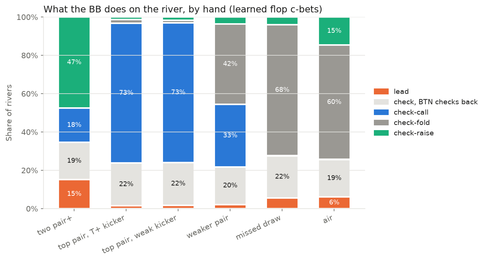

| BB hand | Leads | vs a BTN bet: fold / call / check-raise | Wins when it calls |
|---|---|---|---|
| two pair+ | 15% | 0% / 27% / 73% | 72% |
| top pair (either kicker) | 1–2% | 2–3% / 96% / 2% | 46–48% |
| weaker pair | 2% | 54% / 42% / 5% | **28%** |
| missed draw | 6% | 94% / 0% / 6% | — |
| air | 6% | 80% / 0% / 20% | — |

* **Check and let the BTN bet.** The BB leads only 4% of rivers; the BTN bets 79% when checked to.
* **Weaker pairs are pure bluff-catchers at the exact break-even point.** Calling a 2/3-pot bet needs
  28.6% equity, and when they call they win **28%**. The learned BB mixes fold (54%) and call (42%),
  which is what equilibrium theory says an indifferent bluff-catcher should do.
* **Top pair always calls** (96%) and wins about half the time.
* **Two pair+ check-raises for value (73%),** except on rivers that pair the board (31%) or put a third
  suited card out (68%). There, two pair can be beaten by full houses and flushes, so it calls instead.
* **Missed draws give up (94% fold).** Their bluffing role goes to air, which check-raises as a bluff 20%
  of the time: hands with no showdown value are the ones that can afford to bluff.

### Benchmarks: MDF and bluff share

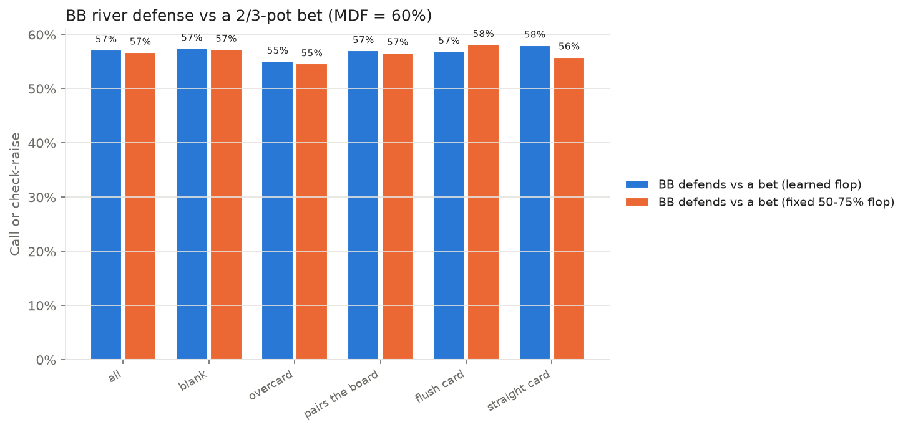

* **The BB defends 57% vs a river bet,** a little under the 60% MDF. That's fine here: the BTN's river
  bets aren't a pure bluff-or-nuts range, so the BB doesn't have to defend the full MDF to keep the
  BTN from betting any two cards.
* **34% of the BTN's river bets lose at showdown,** vs 28.6% for a perfectly balanced bettor. The excess
  is mostly thin value bets that run into the BB's better hands, not pure bluffs.

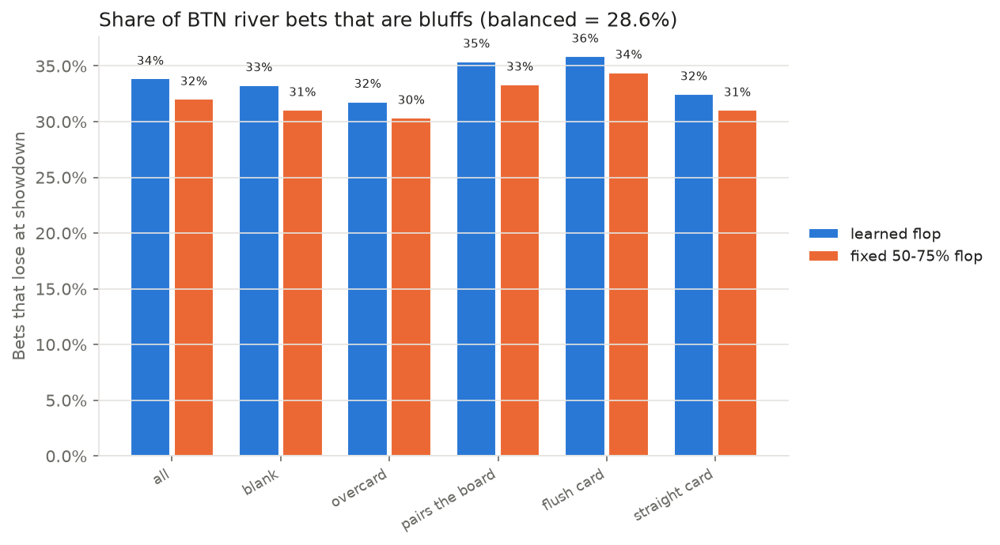

### By river card

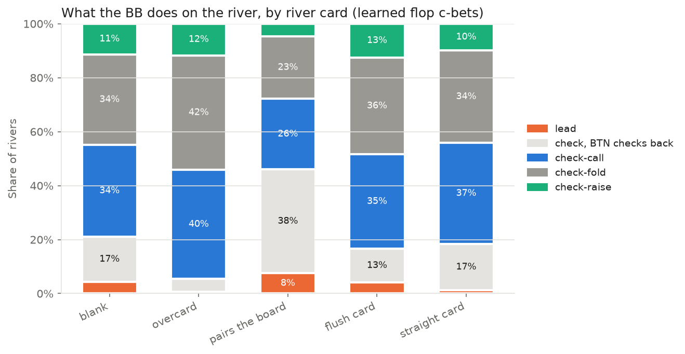

| River card | BB leads | BTN bets when checked to | BB fold / call / check-raise | BB wins when calling |
|---|---|---|---|---|
| blank | 4% | 83% | 43% / 43% / 14% | 33% |
| overcard | 1% | 95% | 45% / 43% / 12% | 31% |
| pairs the board | 8% | 58% | 43% / 49% / 9% | 42% |
| flush card | 4% | 87% | 43% / 42% / 15% | 37% |
| straight card | 1% | 83% | 42% / 46% / 12% | 33% |

* **Board-pairing rivers favor the BB:** the BTN bets least (58%), the BB leads most (8%; missed draws
  lead 13% as bluffs), and the BB's calls win most often (42%).
* **Overcard rivers favor the BTN:** it bets 95% and the BB almost never leads.
* **Flush rivers bring the most check-raises** (15%).

### After the fixed 50–75% flop c-bets

Nearly the same river strategy. The BB arrives with more missed draws (7% vs 2%) and air (2% vs 1%),
and that air leads the river as a bluff 26% of the time. Defense stays at 57%; the BTN's losing-bet
share drops to 32%.

## Experiment 13: Multiple bet sizes on every street

`scripts/bet_sizing_study.py` + `preflop/sizedgame.py`. Same line as experiments 8, 11 and 12
(2.25bb open; BB checks the flop and calls a c-bet; BB check-calls a turn bet), but every bet or
lead now picks a size:

| Street | Sizes (fraction of the pot) |
|---|---|
| flop c-bet | 1/3, 3/4 |
| turn bet / lead | 1/2, pot |
| river bet / lead | 1/2, pot, 1.5x (overbet) |

Raises stay at 3x the bet. Every response is learned separately for each size faced. The turn
and river remember earlier sizes, so each flop size (and each flop-size × turn-size pair) gets its
own strategy, since the pot differs.

**Validation:** `python scripts/bet_sizing_study.py single` runs the same code with one size per
street. It reproduces experiment 8 (c-bets 58.5%; BB fold / call / check-raise 34 / 47 / 19%),
experiment 11 (turn 52 / 38 / 10%; BB leads 26% when the turn pairs the board) and experiment 12
(river 43 / 44 / 13%; the BB's calls win 36%; 34% of BTN bets lose at showdown).

### The Button: big bets are polarized, small bets are merged

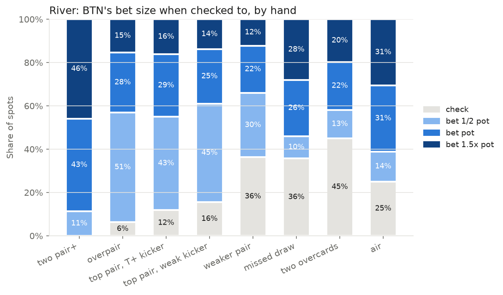

* **Flop (c-bets 61%):**
  * big (3/4) with two pair+ (73%) and draws (78%)
  * small (1/3) with overpairs and top pair (50–69%)
  * weak pairs mostly check (57%)
  * air splits check / small / big (46 / 28 / 27%)
* **Flop by board:** A-high boards are mostly small bets (57%) with few checks (11%). Boards that
  favor the BB get checked half the time.
* **Turn (bets 74% when checked to):** pot-size with two pair+ (72%) and draws (62%, semi-bluffs);
  half-pot with overpairs and top pair.
* **River (bets 79%):** the textbook polarized / merged split. Two pair+ bets pot or 1.5x 89% of
  the time (46% overbets). Overpairs and top pair mostly bet 1/2 pot (43–51%). The bluffs (air,
  missed draws) go big: pot or overbet 54–61%.

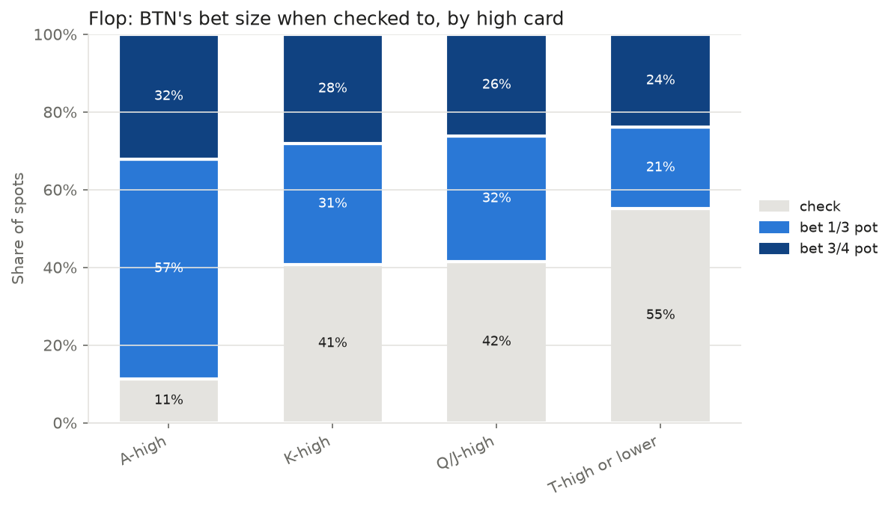

### The Big Blind: how it answers each size

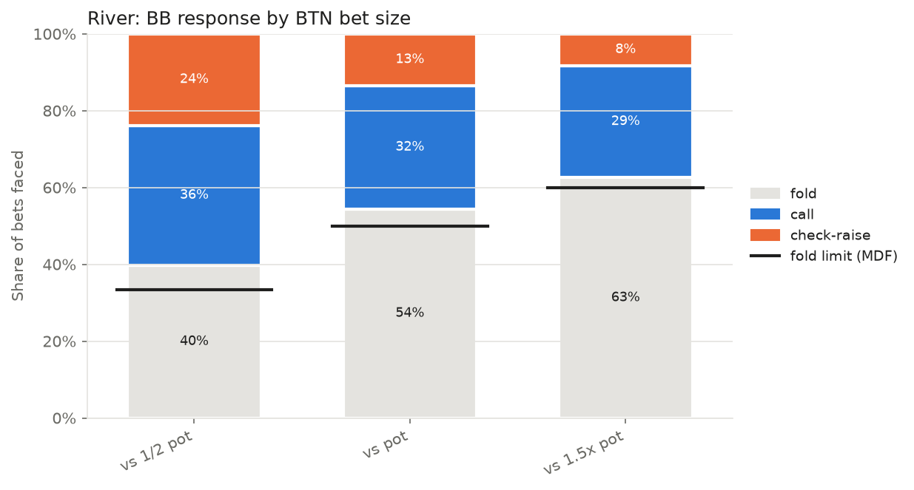

| Street | BTN bet | BB fold / call / check-raise | BB defends | MDF |
|---|---|---|---|---|
| flop | 1/3 pot | 42% / 31% / 27% | 58% | 75% |
| flop | 3/4 pot | 59% / 25% / 16% | 41% | 57% |
| turn | 1/2 pot | 40% / 40% / 20% | 60% | 67% |
| turn | pot | 58% / 29% / 13% | 42% | 50% |
| river | 1/2 pot | 40% / 36% / 24% | 60% | 67% |
| river | pot | 54% / 32% / 14% | 46% | 50% |
| river | 1.5x pot | 63% / 29% / 8% | 37% | 40% |

* **Small bets get check-raised a lot.** Vs a 1/3-pot flop c-bet, the BB check-raises 27% (vs 19% when
  1/3 was the only size). The BTN bets its strongest hands big, so its small-bet range is capped,
  and the BB attacks it: top pair raises 61–76%, weaker pairs 33%, draws 88%. Vs a 3/4-pot c-bet
  it raises only its best hands and draws.
* **Bigger bets get more folds,** but the BB stays close to MDF on the turn and river and well
  below it on the flop. The BTN's big flop bets are mostly value and draws, so folding is right.
* **River bluff-catching follows the theory.** A balanced bettor's share of bluffs should rise
  with bet size (25% / 33% / 37.5% for 1/2 / pot / 1.5x). Here the share of BTN bets that lose
  at showdown rises the same way: 33% / 37% / 38%.
  * Vs a half-pot bet the BB's calls win 27%, just above the 25% break-even.
  * Vs pot and overbets they win 42% and 48%, well above break-even. The BB only calls big bets
    with strong hands.

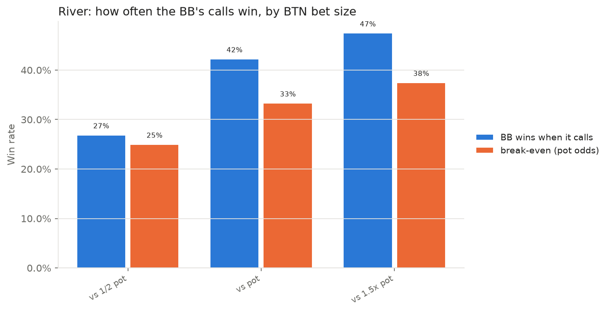

* **Turn leads become block bets.** With a half-pot option, the BB leads the turn far more with
  medium hands: top pair 24–32% (mostly half-pot), two pair+ 35% (half split between sizes).
  It leads 31% when the turn pairs the board.
* **River leads are small.** Medium and weak hands lead 1/2 pot as blockers or bluffs: top pair
  weak kicker 21%, air 20%, missed draws 18%. Big leads are rare.

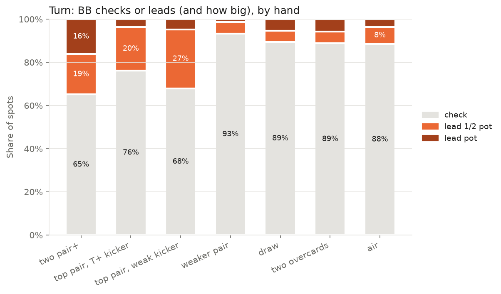

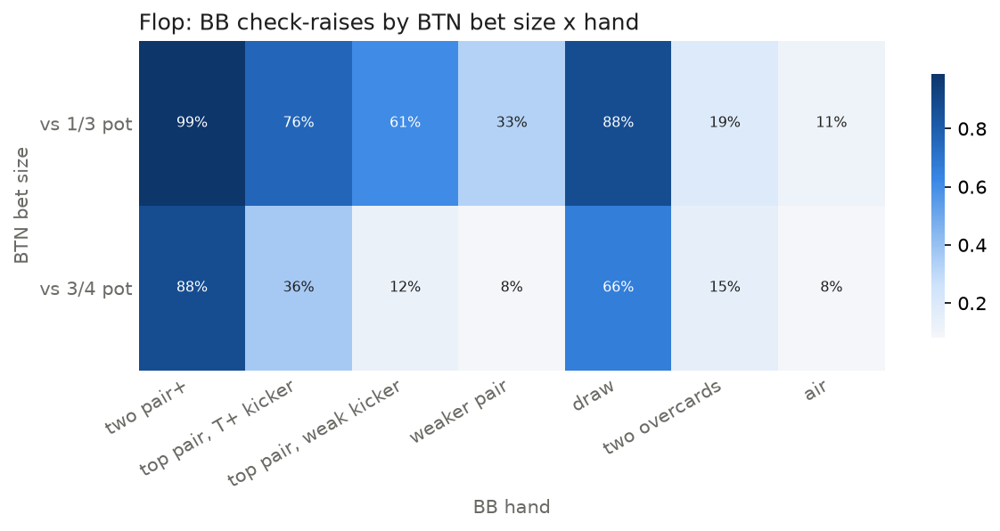

## Experiment 14: How close is the model to a real solver?

`scripts/solver_compare.py` solves 12 flops with **TexasSolver**
([bupticybee/TexasSolver](https://github.com/bupticybee/TexasSolver), AGPL-3.0, not included in this
repo: download the v0.2.0 macOS release into `tools/`; the binary runs under Rosetta on Apple
silicon). TexasSolver plays the real game on exact cards, with no buckets or rules. Each flop uses
the same preflop ranges, pot (4.5bb) and stacks (97.75bb) as experiment 13, and the same flop
decisions: the BB checks, the BTN checks or bets 1/3 or 3/4 pot, and the BB folds, calls or
raises (about 3x).

**The solver's later streets have to be smaller than the model's.** With leads, raises and one size
on the turn and river, each flop needed 10–16 GB of memory and ~3 min per iteration, which is
impractical on a laptop. The main comparison uses a **medium** tree: either player can bet the turn
(2/3 pot) and the river (3/4 pot), with no raises there. Every flop solved to 0.22–0.30% exploitability
(~3–13 min each, three at a time). A **simple** tree, where the BB can only call or fold on the turn
and river, is kept as a sensitivity check.

Flops: A♠7♦2♣, A♥K♦5♥, K♥8♦3♣, Q♦J♥4♦, T♦9♥6♣, 8♠6♠4♦, 7♣5♦3♥, J♥7♥2♥ (single-suit), K♦K♣4♠, 7♥7♦2♠, T♠5♣2♦, 9♣6♣5♦.

### Board level: the model gets the pattern right

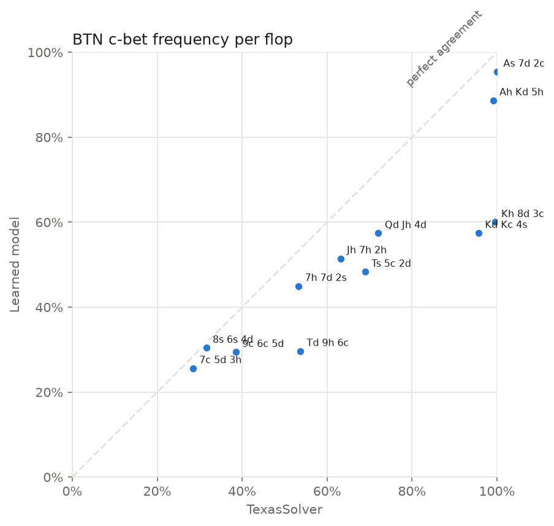

| Decision | Solver avg | Model avg | Mean abs. difference | Correlation across flops |
|---|---|---|---|---|
| BTN c-bets | 67% | 52% | 15 pts | **0.88** |
| BTN bets big (share of its bets) | 69% | 49% | 26 pts | 0.52 |
| BB folds vs 1/3-pot c-bet | 29% | 36% | 8 pts | 0.77 |
| BB check-raises vs 1/3-pot c-bet | 18% | 26% | 8 pts | 0.62 |
| BB folds vs 3/4-pot c-bet | 52% | 59% | 7 pts | **0.88** |
| BB check-raises vs 3/4-pot c-bet | 10% | 16% | 6 pts | **0.85** |

* **C-bet frequency tracks the solver closely across boards (r = 0.88).** Both bet nearly everything on
  A-high flops (solver 99–100%, model 89–95%) and bet least on low connected boards (solver 28–39%,
  model 26–30%). The BB's response to a big bet is also well matched (r = 0.85–0.88).
* **The model c-bets too little on K-high and paired boards.** On K♥8♦3♣ and K♦K♣4♠ the solver bets
  96–100%, mostly *small*; the model bets ~60%. Those boards look "neutral" to the model's texture
  features, but with these ranges the BTN has a big advantage there (the BB's calling range has few
  kings).
* **The model under-uses the big size,** especially on low boards. There the solver bets 3/4 pot with
  almost every bet (98% on 8♠6♠4♦ and 7♣5♦3♥) and checks the rest, a very polarized strategy.

### Hand level: where the abstraction breaks down

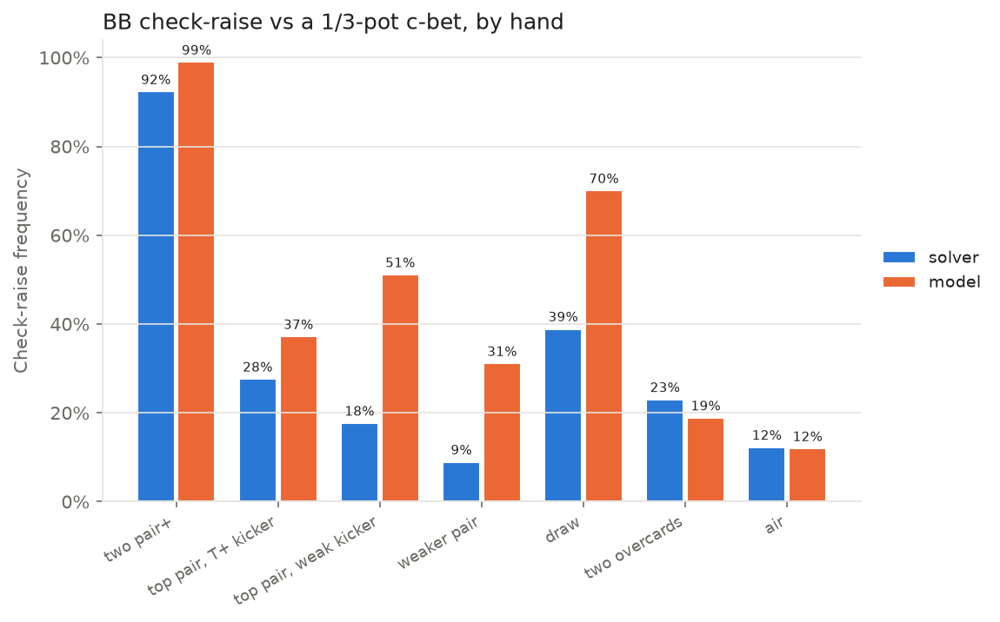

* **The BB never folds a pair or draw to a small c-bet in the solver** (0%), but the model folds top
  pair 12–22% and weak pairs 8% of the time.
* **The model check-raises medium hands far too often:**
  * top pair with a weak kicker 51% (solver 18%)
  * weaker pairs 31% (solver 9%)
  * draws 70% (solver 39%)

  The solver *calls* with them instead (pairs 82–91%, draws 61%). Only two pair+ (92–99%) and air (12%) match.
* **The solver's BTN protects its checking range:** it checks 35% of overpairs and 18–25% of top pairs.
  It also bluffs more: air bets 71% vs the model's 45%. The model bets nearly all of its strong
  hands and checks too much air.
* **Why:** the model's buckets lump very different hands together. "Top pair, T+ kicker" includes
  both AK on A-high and T9 on T-high, and "air" includes backdoor draws and overcards with
  blockers. The model's turn and river are also played by simple rules, so it can't plan the
  multi-street lines (check-call, slowplay, delayed bluffs) that make calling and checking
  valuable in the solver.

### Sensitivity: what the BB can do on later streets changes the flop

With the **simple** tree (the BB can never bet the turn or river), the solver c-bets **87%** of flops
instead of 67% and bets big 72% of the time. Giving the BB later-street betting rights shrinks the
BTN's flop betting by 20 points. Flop strategy depends heavily on what each player can do on later
streets, which is also why the model's rules-based turn and river limit its flop accuracy.

## Experiment 15: The whole hand learned together

`scripts/fullgame_study.py` + `preflop/fullgame.py`. Earlier experiments learned one street at a time and
played later streets with rules, so no player could plan multi-street lines. Here flop, turn and river are
**one game**, learned with external-sampling Monte Carlo CFR: for each sampled hand, the learning player
tries every option while the opponent's moves are sampled. A flop decision is valued by how the rest of
the hand actually plays out.

* **Hand buckets (12):** straight or better, set / trips, two pair, overpair, top pair (T+ kicker / weak
  kicker), middle pair, weak pair, strong draw, weak draw (gutshot / backdoor flush), overcards, air.
  On the river the draws become missed draws.
* **Line memory:** later streets know who bet last on the previous street and how deep the stacks are
  vs the pot.
* **Sizes:**
  * BB flop lead ("donk") 1/3 pot
  * BTN flop bets 1/3 / 3/4
  * turn leads 1/2, bets 1/2 / pot
  * river leads 1/2, bets 1/2 / pot / 1.5x
  * raises 3x
* **Training:** 250 batches × 60k hands per scenario, then each is evaluated exactly on the same 300k
  hands. Re-training the `donk` scenario with a different seed gave the same result to 0.001bb, so
  differences between scenarios aren't training noise.

Results are the BB's **net result for the whole hand, in bb per called pot**:

| Scenario | BB net |
|---|---|
| base: BB never donks | −0.869 |
| donk: BB may lead the flop 1/3 pot (learned) | −0.872 |
| donk_often: BB leads 50% of flops with every hand | **−1.156** |
| no_early_bluffs: BB never bluffs the flop or turn | −0.916 |
| slowplay 0% / 25% / 50% / 75% of strong hands | −0.882 / **−0.876** / −0.879 / −0.887 |

### Multi-street lines: check-calling with medium hands

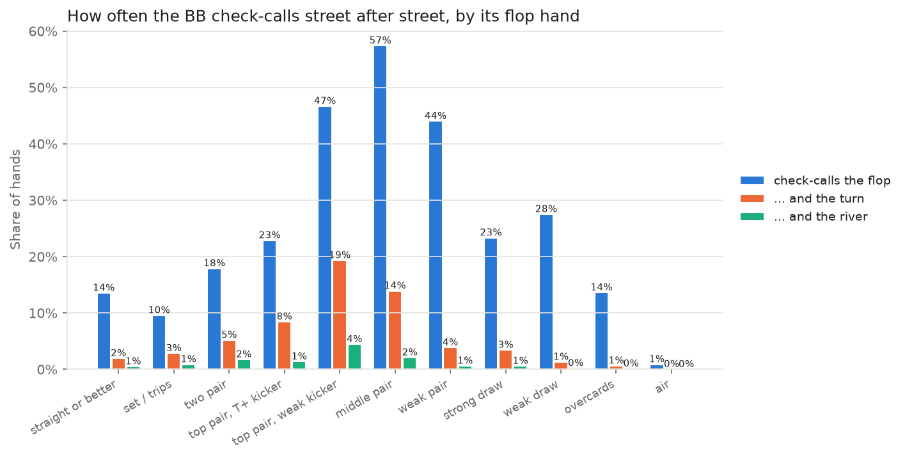

How often the BB check-calls a bet on the flop, then the turn too, then the river too, by its flop hand
(the BTN has to bet each time):

| BB flop hand | Check-calls the flop | ... and the turn | ... and the river |
|---|---|---|---|
| top pair, weak kicker | 47% | **19%** | 4% |
| middle pair | 57% | **14%** | 2% |
| weak pair | 44% | 4% | 1% |
| top pair, T+ kicker | 23% | 8% | 1% |
| two pair | 18% | 5% | 2% |
| strong draw | 23% | 3% | 1% |

* **Check-calling twice is a medium-hand line,** mainly weak top pair and middle pair. They have enough
  showdown value to call twice but are too weak to raise.
* **Weak pairs usually stop after one call;** their turn calls drop to 4%.
* **Strong top pair and two pair call less** because they check-raise more often.
* **Calling down all three streets is rare** (≤4%): by the river, most medium hands either face a check or
  give up.

### Slowplaying: how often, and with what

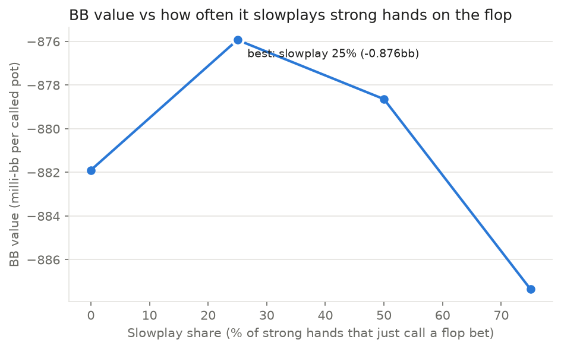

* **The best slowplay share is about 25%.** Forcing the BB to just call a flop bet with 0 / 25 / 50 / 75%
  of its strong hands (straight+, sets, two pair) gives −0.882 / −0.876 / −0.879 / −0.887bb. Never
  slowplaying costs 0.006bb per called pot and slowplaying 75% costs 0.011bb. The value curve is flat,
  so getting the mix roughly right matters more than the exact number.
* **The learned strategy agrees.** Facing a flop bet, the BB calls instead of raising with:
  * two pair 25% of the time
  * straights or better 26%
  * sets 18%, the least: sets are the hands that most want the pot to grow now
* **The BTN almost never slowplays:** it checks back strong hands on the flop only 4–7% of the time.

### Bluff timing: preflop and river vs flop and turn

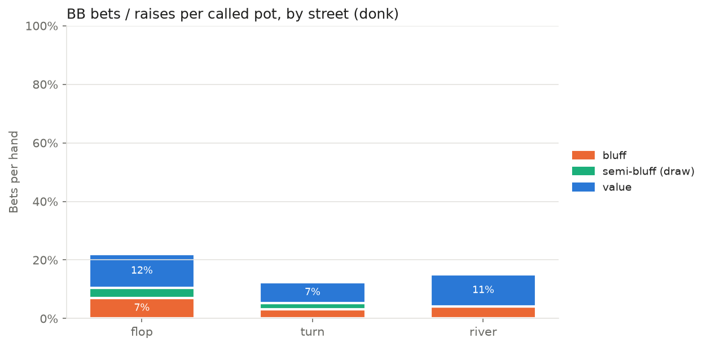

* **In the learned strategy, half of the BB's postflop bluffs happen on the flop** (check-raise and donk
  bluffs): flop 0.071, turn 0.031, river 0.041 bluffs per called pot, plus semi-bluffs with draws on the
  flop and turn.
* **Moving bluffs to the river costs the BB.** Banning weak-hand bets and raises on the flop and turn raises
  its river bluffs by 27% (0.041 → 0.052 per hand) but costs **0.044bb per called pot** (−0.872 → −0.916).
  Early bluffs work because the BTN's wide c-betting range folds a lot to check-raises.
* **Preflop bluffs barely exist in this model:** the BB 3-bets 21% of its hands, but only 0.45% of hands
  (22) are 3-bets with under 50% equity vs the BTN's opening range. The preflop model uses equity
  realization, not postflop play, so it has no reason to 3-bet bluff. Adding real 3-bet-bluff value
  would need a preflop model that plays out the postflop game.

### Donk bets: often, small, and on which boards?

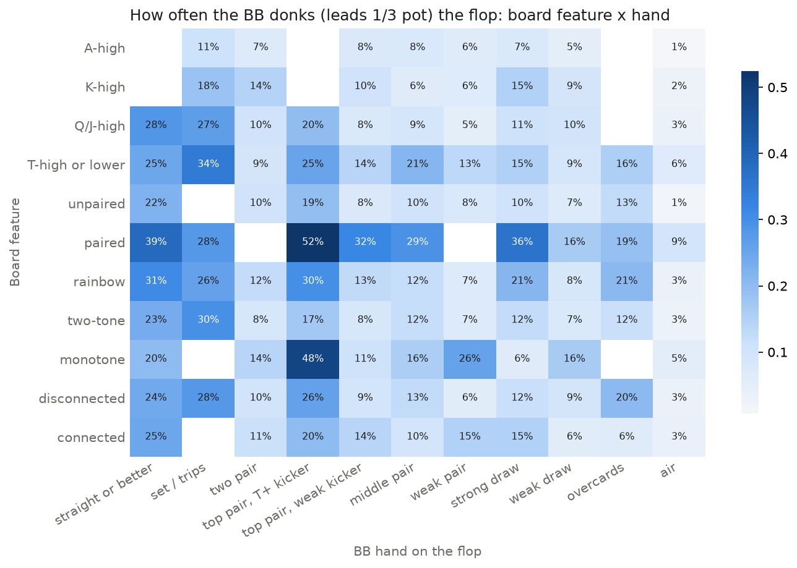

* **When it may choose, the BB donks rarely:**
  * A-high boards 4%, K-high 6%, Q/J-high 7%, T-high or lower 13%
  * paired boards 16%, single-suit boards 12%
* **It donks mostly with strong top pairs and sets on boards that favor it:** top pair T+ kicker donks
  52% on paired boards and 48% on single-suit boards; sets donk 34% on low boards.
* **Having the donk option is worth almost nothing:** −0.009 to +0.024bb per called pot by board, and
  −0.003 overall. That matches solver lore that donking adds little when the caller is out of position.

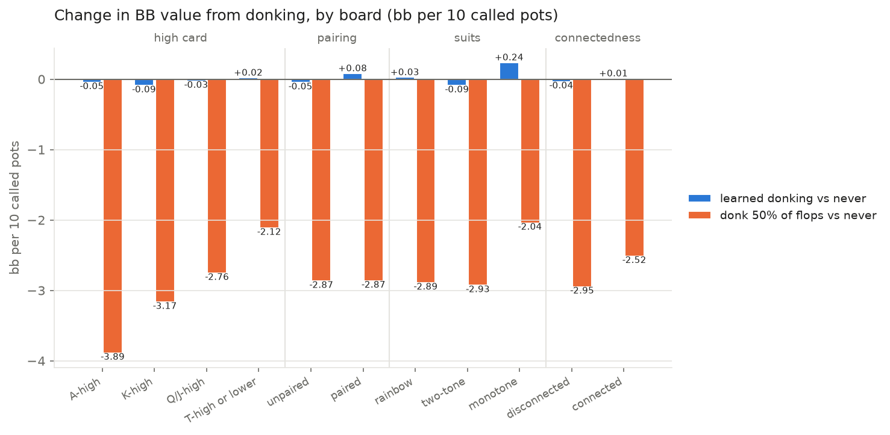

* **Donking 50% of flops with every hand is a big leak: −0.29bb per called pot.** The BTN raises and floats
  a weak, capped donking range. Board by board, the cost (bb per 10 called pots):

| Board | Cost of donking 50% |
|---|---|
| A-high | −3.9 |
| K-high | −3.2 |
| Q/J-high | −2.8 |
| connected | −2.5 |
| T-high or lower | −2.1 |
| single-suit | −2.0 |

* **If the BB wants to donk often, low and single-suit boards are where it hurts least,** because those boards
  favor the BB's range. A-high and K-high boards, where the BTN's range is strongest, are the worst. On
  every texture, small frequent donking with the whole range still loses vs donking selectively.

## Experiment 16: Best sizes vs every open, the BTN's 2.25bb plan, and TexasSolver again

`scripts/open_size_study.py` (train / solve / report). The whole-hand model (experiment 15) is trained
at BTN opens of **2.0, 2.25, 2.5 and 3.0bb**, with preflop ranges from the preflop solver at each size.
It has a bigger sizing menu so it can pick its own sizes:

| Street | BB leads | BTN bets | Raises (either player) |
|---|---|---|---|
| flop | 1/3 or 3/4 pot (donk) | 1/3 or 3/4 pot | 2.5x or 4x |
| turn | 1/2 or pot | 1/2 or pot | 2.5x or 4x |
| river | 1/2 or pot | 1/2, pot or 1.5x | 2.5x or 4x |

The generalized model reproduces experiment 15 exactly when given its old sizes. Each open size took
16–23 min to train (250 batches × 60k hands) and was evaluated exactly on 150k hands.

### The BB vs each open size

| BTN open | BB preflop fold / call / 3-bet (to) | BB net per called pot | BTN bets the flop when checked to | BB vs 1/3 c-bet: fold / call / raise 2.5x / raise 4x |
|---|---|---|---|---|
| 2.0 | 1% / 76% / 23% (6.5) | −0.85 | 78% | 48 / 21 / 19 / 12% |
| 2.25 | 10% / 69% / 21% (7.3) | −0.85 | 75% | 46 / 19 / 23 / 12% |
| 2.5 | 19% / 61% / 20% (8.1) | −0.81 | 72% | 45 / 22 / 22 / 12% |
| 3.0 | 35% / 47% / 18% (9.75) | −0.84 | 69% | 40 / 26 / 24 / 10% |

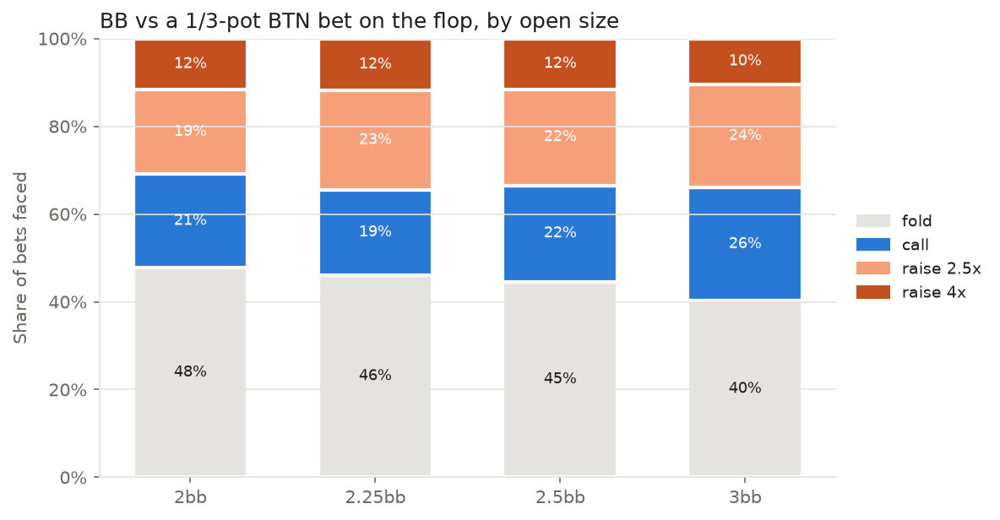

* **Bigger opens get a tighter BB, and its postflop results barely change** (−0.81 to −0.85bb per called
  pot). The adjustment happens preflop (folding 1% → 35%); afterwards the BB folds less to c-bets
  (48% → 40%) because its range is stronger, and the BTN c-bets less (78% → 69%).
* **Raise sizes depend on the street:**
  * **Flop:** the BB prefers the **small 2.5x check-raise** (19–24% vs a 1/3 c-bet, 12% vs a 3/4 c-bet),
    with 4x as a smaller, stronger part (10–12% / 5%).
  * **Turn:** vs a half-pot bet the **4x raise** is used more (10–11%) than 2.5x (7–10%).
  * **River:** vs a half-pot bet the BB raises almost only **4x** (15%, vs 2% at 2.5x), a polarized
    nuts-or-bluff raise. Vs pot and overbets it raises rarely, and small.
* **BB leads:**
  * flop donks are rare: 9–11%, mostly 1/3 pot (5–7%)
  * turn leads grow with the open: 12% → 18%, split evenly between 1/2 and pot
  * the river is where the BB leads most: ~31% (1/2 pot 18%, pot 13%)

### The BTN's 2.25bb plan: c-bet, turn barrel, river

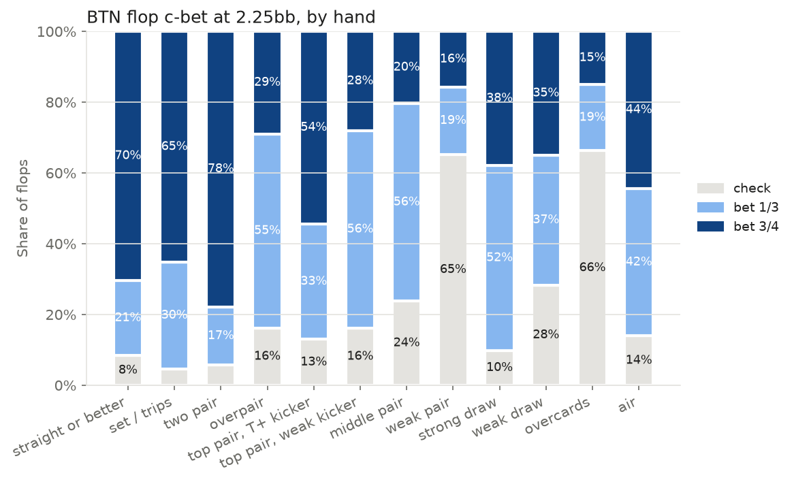

* **Flop c-bet: 75% of flops** (1/3 pot 40%, 3/4 pot 36%).
  * **By board:** A-high flops are bet almost always (check 11%, mostly 3/4 pot); K-high mostly 1/3 pot
    (50%); low, connected and single-suit flops are checked 34–36% of the time.
  * **By hand:** two pair+ goes big (65–78% 3/4 pot). Overpairs, weak top pair and middle pair go small
    (55–56% 1/3 pot). Weak pairs and overcards check (65–66%). Air bets 86% (split small / big), and
    draws bet small (strong draws 52% at 1/3).
* **Turn barrel after a called c-bet:**
  * value keeps betting: straights 99%, sets 92%, two pair 84%, mostly pot-size
  * top pair barrels 66–73%
  * middle and weak pairs check (83–94%) to control the pot
  * draws semi-bluff: weak draws 81%, strong draws 56%
  * air barrels 42%

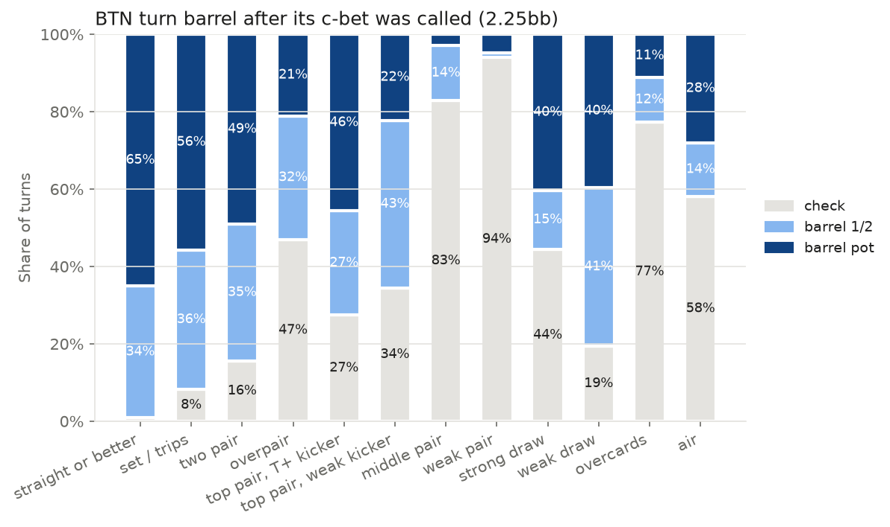

* **River after a called barrel: the bluffs are the missed weak draws.**
  * value overbets: straights+ bet 100% (65% at 1.5x), sets 99% (49% at 1.5x), two pair 86%
  * top pair mostly checks (64–78%)
  * the main bluff is **missed gutshots / backdoors: they bet 83%, 54% as a 1.5x overbet**
  * pure air bets only 25% and missed strong draws 23%. Hands with a little showdown value check;
    the weakest missed draws bluff big.

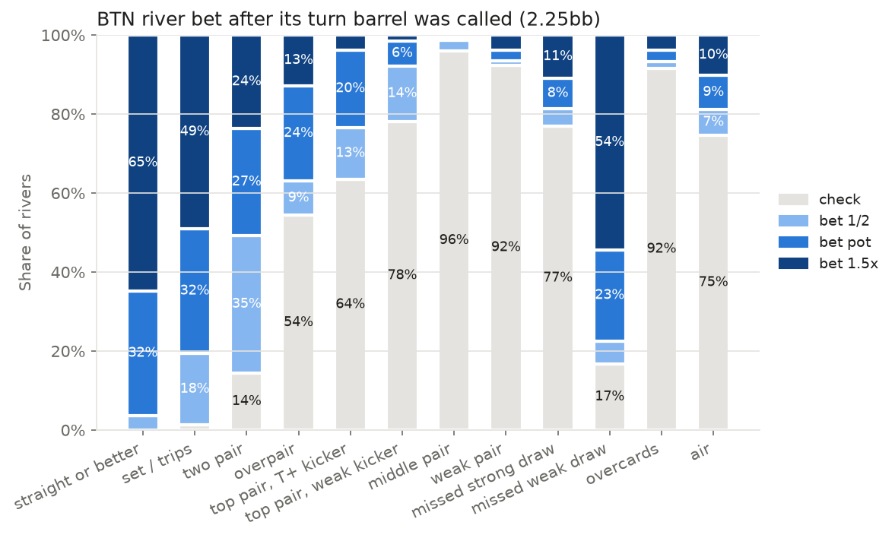

### The most probable lines (2.25bb)

Across all called pots, the most common outcomes are short:

| Line | Probability | BTN holds (strong / pair / draw / air) |
|---|---|---|
| BTN bets 3/4, BB folds | 19.0% | 10 / 26 / 18 / 46% |
| BTN bets 1/3, BB folds | 16.5% | 3 / 39 / 18 / 40% |
| checked down on every street | 4.1% | 0 / 62 / 8 / 31% |
| flop checked through, BTN bets pot on the turn, BB folds | 3.3% | 3 / 34 / 21 / 42% |
| BTN bets 1/3, BB raises 2.5x, BTN folds | 2.0% | 0 / 2 / 2 / 97% |

**When the BTN c-bets and barrels and gets called twice,** the river goes:
* **check-check** in 47% of these lines (most common: 3/4 then 1/2, 17%; 3/4 then pot, 16%)
* **a BTN 1.5x overbet** in 25% (the BB folds to it in 16%)

The BTN's river overbets hold 17% strong hands, 12% pairs, 38% missed draws and 33% air: mostly bluffs.
37% of the BTN's air ends with a flop c-bet the BB folds to.

### TexasSolver comparison (flop decisions, medium tree)

Solved at **2.25bb (12 flops)** and, new, **3.0bb (6 flops)** with that open's ranges (0.25–0.29%
exploitability, 2–8 min each, three at a time).

| Decision | 2.25bb: solver / model / correlation | 3.0bb: solver / model / correlation |
|---|---|---|
| BTN c-bets | 67% / 70% / **0.97** | 61% / 66% / 0.86 |
| BTN bets small (1/3) | 25% / 35% / 0.89 | 33% / 39% / **0.98** |
| BB folds vs 1/3 | 29% / 42% / 0.78 | 35% / 41% / 0.88 |
| BB raises vs 1/3 | 18% / 29% / 0.13 | 15% / 29% / **0.94** |
| BB folds vs 3/4 | 52% / 60% / 0.83 | 55% / 57% / 0.76 |
| BB calls vs 3/4 | 38% / 25% / **0.94** | 38% / 29% / 0.50 |

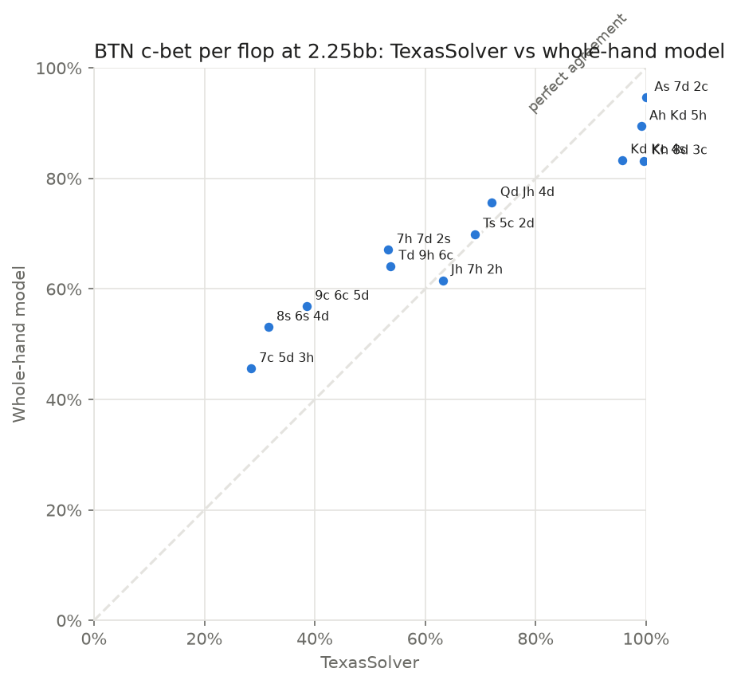

* **Much closer than the street-by-street model.** C-bet frequency per flop correlates **0.97** with the
  solver at 2.25bb (0.88 in experiment 14), and the BTN's c-bet by hand is close: air 87% vs 76%,
  top pair 74–76% vs 75–82%, two pair+ 90–96% vs 100%.
* **The old "BB folds pairs" error is gone:** the model now folds pairs and draws 0–5% to a small
  c-bet, like the solver.
* **It tracks how the open size changes things.** On K♥8♦3♣ the solver's c-bet drops from 100% at
  2.25bb to 59% at 3.0bb (the BB's tighter calling range has more kings); the model goes 83% → 56%.
* **The remaining gap: the BB check-raises too much and calls too little.** It raises middle pair 54%
  and weak top pair 64% vs the solver's 7–18%. The pattern across flops matches at 3.0bb (r = 0.94),
  but the level is about twice the solver's. Likely causes (not yet tested):
  * the model's BTN bluffs air about 10 points more than the solver, which makes raising profitable
  * the model can raise a cheaper 2.5x, while the solver's raise is about 3x
  * the solver's tree has no turn or river raises, so a flop raise there carries less threat

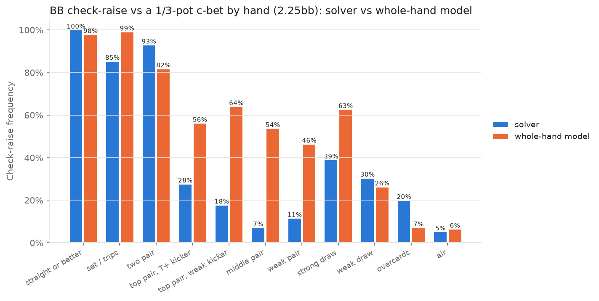

## Next steps

1. **Fix the BB's check-raise level:** give the model a ~3x raise like the solver's, and test whether
   the BTN's extra air c-bets are what make raising so profitable.
2. **Preflop bluffs from postflop play:** feed the whole-hand model's postflop values back into the
   preflop solver, so 3-bet bluffs (A5s, suited connectors) get their real value.
3. **Selective donking:** force donks only on the BB's best boards (low, single-suit, paired).
4. **Stack depth and multiway** play.
