# Heads-Up Preflop Strategy (100bb, Button vs Big Blind)

A data-science look at heads-up no-limit hold'em preflop strategy. Stage 1 asks:
**if only all-in equity mattered, which hands should the Button raise, what size
should it open to, and what should the Big Blind 3-bet?**

## Quick start

```bash
python3 -m venv .venv && .venv/bin/pip install -r requirements.txt
.venv/bin/python -m pytest -q                 # equity engine vs known reference numbers
.venv/bin/python scripts/build_equity.py      # ~2 min -> data/ (already included)
.venv/bin/python scripts/solve.py             # ~10 s  -> output/ charts + CSVs
.venv/bin/python scripts/solve.py --open 3 --threebet 10   # try other sizes
```

## Layout

| Path | What it does |
|---|---|
| `preflop/cards.py` | 169 hand classes, 1,326 combos, 13x13 grid order |
| `preflop/equity.py` | eval7 Monte Carlo equity, equity vs random, 169x169 matrix with card removal |
| `preflop/solver.py` | BTN vs BB game tree solved with CFR+, plus EV and exploitability |
| `preflop/plots.py` | 13x13 range charts, line charts |
| `scripts/` | `build_equity.py` (step 1), `solve.py` (step 2) |
| `tests/` | AA vs random ~85%, AA vs KK ~82%, 22 vs AKo ~coin flip, combo counts |

## The model

```
BTN (SB, 0.5bb):  fold | raise to s          (never limp)
BB  (1bb):        fold | call | 3-bet to t    (t = 4s by default, 9bb vs 2.25)
BTN:              fold | call | all-in 100bb
BB:               fold | call
```

Any call goes straight to showdown and each player wins `pot x equity`.
That's the key simplification: no postflop betting, and position is worth nothing.
CFR+ finds the Nash equilibrium of this game. Exploitability is under 0.1 milli-bb
per hand, so the strategies are effectively exact *for this model*.

## Stage 1 results

| Open | BTN EV (bb/hand) | BTN raises | BB folds | BB calls | BB 3-bets |
|---|---|---|---|---|---|
| 2.0 | -0.119 | 68% | 0% | 79% | 21% |
| **2.25** | **-0.108** | **65%** | **0%** | **81%** | **19%** |
| 2.5 | -0.097 | 63% | 0% | 82% | 18% |
| 3.0 | -0.078 | 60% | 14% | 69% | 17% |
| 3.5 | -0.074 | 58% | 29% | 55% | 16% |
| 4.0 | -0.079 | 57% | 41% | 45% | 14% |

* **BTN at 2.25bb raises 65%** and folds weak offsuit hands and low unconnected
  suited hands (T2s, 9xs-and-below gappers, 87o, 76o...).
* **BB 3-bets ~19%**: pairs 22+, Ax down to A7o / A2s, KQ/KJ/KTs, plus suited
  connectors T9s/98s/87s. **BB never folds** to a 2.25bb open, because even 32o has
  about 32% equity and only needs 28% to call.
* **The equity-only model picks ~3.5bb as the best open, not 2.25bb.** Small opens
  give the BB a great price to see every flop, and nothing here punishes the BB
  for being out of position. Solvers that model postflop play favour 2–2.5bb, so
  the gap is a measure of how much postflop play and position matter. That is
  stage 2.

## Experiment 2: Big Blind defense vs a 2.25–2.50bb open

`scripts/bb_defense.py` (~6 min) solves every BTN open from 2.25 to 2.50bb in
0.05bb steps and tries every BB 3-bet size from 6 to 14bb (0.25bb steps), keeping
the one that earns the BB the most. It runs two models:

* **equity**: raw all-in equity, position is worth nothing.
* **position**: in pots that see a flop, the BTN realizes 110% of its equity and
  the BB 85% (`r_ip`, `r_oop` in `solve()`). These two numbers are illustrative
  assumptions, not measured.

| BTN open | Best 3-bet (equity) | Best 3-bet (position) | BB fold / call / 3-bet (position) |
|---|---|---|---|
| 2.25 | 8.0bb (3.6x) | 10.0bb (4.4x) | 5% / 77% / 18% |
| 2.30 | 8.0bb | 10.5bb | 6% / 76% / 18% |
| 2.35 | 8.25bb | 10.75bb | 9% / 73% / 18% |
| 2.40 | 8.5bb | 11.25bb | 10% / 73% / 17% |
| 2.45 | 8.5bb | 11.5bb | 10% / 73% / 17% |
| 2.50 | 8.75bb (3.5x) | 11.5bb (4.6x) | 13% / 70% / 17% |

* **The best 3-bet scales with the open: about 3.5x in the equity model and about 4.5x
  once the BB is penalized for being out of position.** Playing a bloated pot out of
  position is costly, so the BB 3-bets bigger to make the BTN fold more often
  (the BTN folds ~45% to the 3-bet at every size).
* **The EV curves are flat near the top.** Anything within about ±0.75bb of the
  best size costs under 1 milli-bb per hand (see `good_3bet_range_bb` in `summary.csv`).
* **The 3-bet range barely moves across 2.25–2.50.** It's a linear "value" range:
  pairs 55+, Ax suited down to A4s, offsuit aces down to A7o, broadway hands.
  What changes is the **fold** range. With the position penalty, the BB folds 5%
  vs 2.25bb and 13% vs 2.50bb: every 0.05bb on the open pushes the weakest
  offsuit hands (83o, 74o, 64o, 53o, 43o...) from call to fold.

Outputs in `output/bb_defense/`: `summary.csv`, `bb_ranges.csv` (every hand,
every size, both models), `ev_by_3bet_size.csv`, and range / EV charts.

## Experiment 3: Sweeping the BB's out-of-position penalty

Only the ratio `r_ip / r_oop` changes the results, so `scripts/realization_sweep.py`
fixes the BTN at 1.0 and sweeps the BB's `r_oop` from 0.75 to 1.0. Experiment 2's
1.10 / 0.85 "position model" is r_oop ≈ 0.77 on this scale.

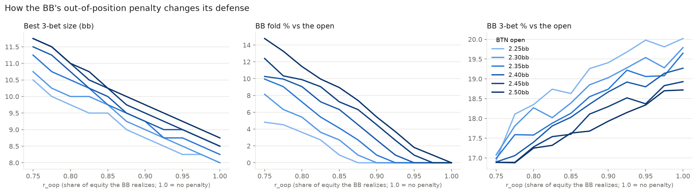

| r_oop | Best 3-bet vs 2.25 | BB fold vs 2.25 | Best 3-bet vs 2.50 | BB fold vs 2.50 |
|---|---|---|---|---|
| 1.00 | 8.0bb (3.6x) | 0% | 8.75bb (3.5x) | 0% |
| 0.90 | 8.75bb (3.9x) | 0% | 9.75bb (3.9x) | 5% |
| 0.80 | 9.75bb (4.3x) | 4% | 11.0bb (4.4x) | 11% |
| 0.75 | 10.5bb (4.7x) | 5% | 11.75bb (4.7x) | 15% |

* **The best 3-bet size grows almost linearly as the penalty grows**, from about 3.5x
  the open with no penalty to about 4.7x at r_oop 0.75.
* **Folding starts only once the penalty is real.** Against 2.25bb the BB keeps
  defending everything until r_oop drops below ~0.86. Against 2.50bb, folds start
  at ~0.97.
* **The 3-bet frequency falls slightly** (20% → 17%): a bigger size means a tighter range.
  The jagged lines come from the 0.25bb size grid.

## Experiment 4: The Button chooses its open size too

`scripts/sizing_game.py` lets the Button choose an open from 2.0 to 4.0bb, knowing the
BB will answer with its best 3-bet size (2.5x–6x the open). Each player uses one size
for every hand.

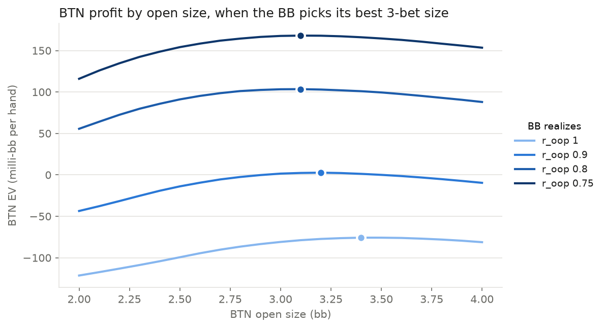

| r_oop | BTN best open | BB 3-bets to | BTN raises | BB fold / call / 3-bet | Cost of opening 2.2bb |
|---|---|---|---|---|---|
| 1.00 | 3.4bb | 11.9bb (3.5x) | 58% | 25% / 59% / 17% | 3.7bb/100 |
| 0.90 | 3.2bb | 12.4bb (3.9x) | 67% | 28% / 56% / 17% | 3.4bb/100 |
| 0.80 | 3.1bb | 14.3bb (4.6x) | 79% | 29% / 55% / 17% | 3.1bb/100 |
| 0.75 | 3.1bb | 15.5bb (5.0x) | 86% | 29% / 55% / 16% | 3.3bb/100 |

* **The Button's best open stays at 3.1–3.4bb whatever the penalty.** Penalizing the BB
  makes the Button profitable and lets it open far more hands (58% → 86%), but the best
  size only drops from 3.4 to 3.1bb.
* **So this model still can't produce 2.25bb opens.** Small opens are what solvers that
  play the full game recommend. The model is missing whatever makes small opens work:
  postflop betting, hand-by-hand realization (suited/connected hands realize more), and
  mixing sizes by hand.
* **The BB's answer to a bigger open is a bigger 3-bet**, reaching 5x the open at r_oop 0.75.

## Experiment 5: Hand-by-hand realization — where 2.25bb appears

`scripts/hand_realization.py` adds two kinds of per-hand realization on top of the
BB's position penalty (r_oop = 0.85), then reruns the open-size game (opens
1.75–3.5bb every 0.05bb, BB best-responds with its 3-bet size):

* **Playability (k):** suited, connected and broadway hands realize more
  (`preflop/realization.py`, hand-picked bonuses).
* **Strength (alpha):** the BTN's pot share becomes `E^a / (E^a + 0.85 (1-E)^a)`.
  With a > 1, strong hands realize more than their equity and weak hands less,
  because after the flop strong hands win bigger pots and weak hands fold. At a = 1.5,
  a 30%-equity hand realizes about 73% of its equity and a 60% hand about 108%.

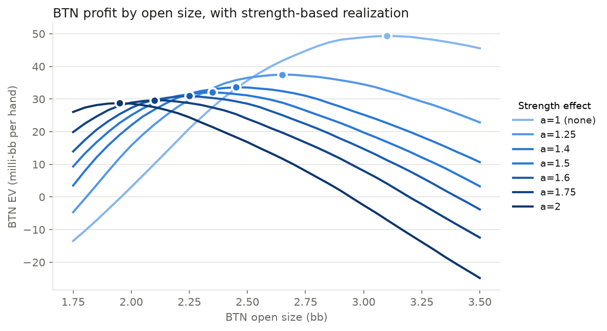

| Model | BTN best open | Opens within 1 mbb of best | Cost of 2.25 (bb/100) | BB 3-bet vs 2.25 |
|---|---|---|---|---|
| position only | 3.10bb | 2.95–3.25 | 2.84 | 9.6bb |
| playability k=2 | 3.25bb | 3.05–3.40 | 2.79 | 9.0bb |
| strength a=1.25 | 2.65bb | 2.50–2.80 | 0.78 | 7.9bb |
| strength a=1.4 | 2.45bb | 2.35–2.60 | 0.20 | 7.3bb |
| **strength a=1.5** | **2.35bb** | **2.25–2.50** | **0.06** | **7.3bb** |
| **strength a=1.6** | **2.25bb** | **2.15–2.35** | **0.00** | **6.75bb** |
| strength a=1.75 | 2.10bb | 2.00–2.25 | 0.09 | 6.75bb |
| strength a=2.0 | 1.95bb | 1.85–2.05 | 0.44 | 6.2bb |
| both a=1.5 k=2 | 2.40bb | 2.25–2.50 | 0.09 | 7.3bb |

* **Playability bonuses don't explain small opens.** They help both players' good
  hands, so they mostly cancel out, and the best open stays above 3bb.
* **The strength effect does.** At a ≈ 1.5–1.6, a 2.25bb open is the best size (or
  within 0.06bb/100 of it). The more postflop play rewards strong hands and punishes
  weak ones, the smaller the best open: a smoothly falling curve from 3.1bb to 1.95bb.
* **Why:** a small open gets called by many weak BB hands that will underperform
  after the flop. The BTN *wants* those calls, so it keeps the price low.
* At a = 1.5 vs a 2.25bb open, the BTN raises 71%. The BB folds 26%, calls 53%,
  and 3-bets 21% to ~7.3bb (about 3.25x), a smaller 3-bet than in the equity-only models.

Caveat: alpha is a single knob chosen to match a known answer, not fitted to
data. Calibrating it against real solver EVs is the next step.

## Experiment 6: Calibrating realization, then measuring it by simulation

### 6a. Calibration to published solver numbers (`scripts/calibrate.py`)

Targets for the BB vs a ~2.5bb open at 100bb, from the
[Preflop Wizard heads-up guide](https://www.preflopwizard.app/blog/poker-heads-up-strategy):
fold 30–35%, 3-bet 15–20%, 3-bet size 9–10bb. This is a weak source: an aggregate of
unnamed solver runs that include limping, which this model doesn't allow.

A grid search over α (1.0–2.0) and r_oop (0.70–1.00) finds **α = 1.4, r_oop = 0.75**
fits every target (fold 31%, 3-bet 21% to 9bb). α is well pinned down (1.3–1.5);
r_oop less so (0.70–0.80 all fit).

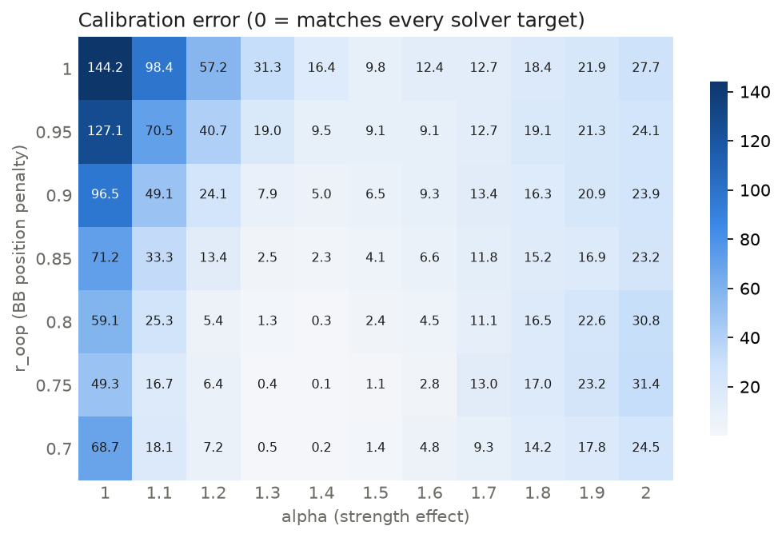

**Out-of-sample check:** the open size was not a target, yet the calibrated model's
best BTN open is **2.45bb** (2.35–2.6 within 1 milli-bb), inside the 2–2.5bb that
solvers use. Opening 2.25bb instead costs only 0.19bb/100.

### 6b. Measuring realization with simple postflop rules (`scripts/simulate_realization.py`)

`preflop/postflop.py` plays hands out from the flop. Both players follow the same rules:

| Strength (from the cards each player sees) | First to act / checked to | Facing a bet |
|---|---|---|
| **Strong**: two pair+ that improves the board, overpair, top pair with T+ kicker | bet 2/3 pot | call |
| **Medium**: any other pair using a hole card, or a flush draw / open-ended straight draw (not on the river) | check | call |
| **Weak**: everything else | bluff 1/3 of the time, else check | fold |

The BB acts first every street; one bet per street at most and no raises. Hands are dealt
from the model's BTN opening range vs BB calling range at a 2.25bb open, 1.4M hands
per round. Then α and r_oop are fitted to the results, the preflop game is re-solved
with them, and the loop repeats until they stop moving (2 rounds).

| | α | r_oop | BTN best open |
|---|---|---|---|
| Calibrated to solver numbers (6a) | 1.40 | 0.75 | 2.45bb |
| **Simulated from simple rules (6b)** | **1.36** | **0.80** | **2.45bb** (2.35–2.65) |

On average the BTN wins 63% of the flop pot with 55% equity.

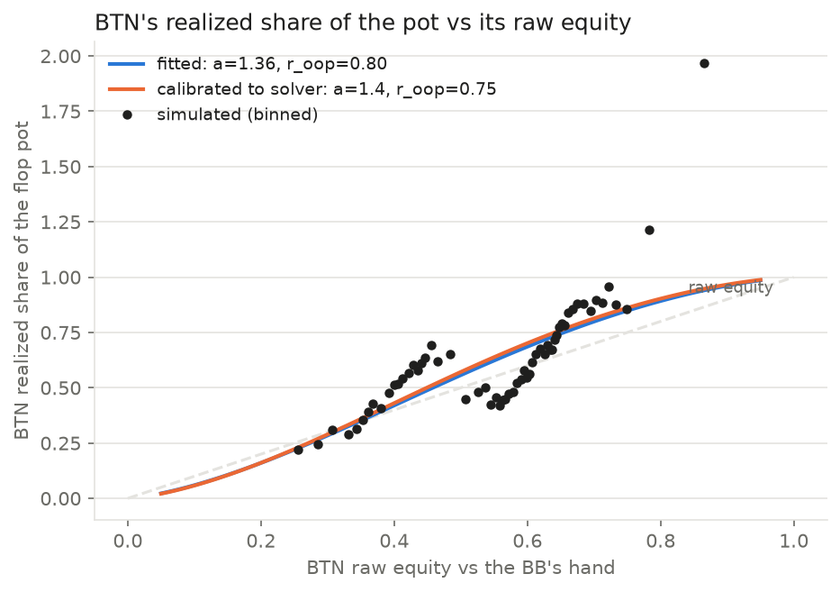

Per-hand realization (realized share ÷ raw equity):

* **BTN (in position):** big pairs realize the most (AA 2.7x, KK 2.3x, small pairs ~1.4x,
  because the rules pay them off with any pair). Suited connectors 1.3–1.4x.
  Offsuit weak aces and kings only 0.8–0.9x.
* **BB (out of position):** offsuit trash (A2o–A5o, K2o–K6o, Q2o–Q6o) realizes only
  ~0.6–0.7 of its equity; suited connectors and broadway offsuit ~1.0–1.2.

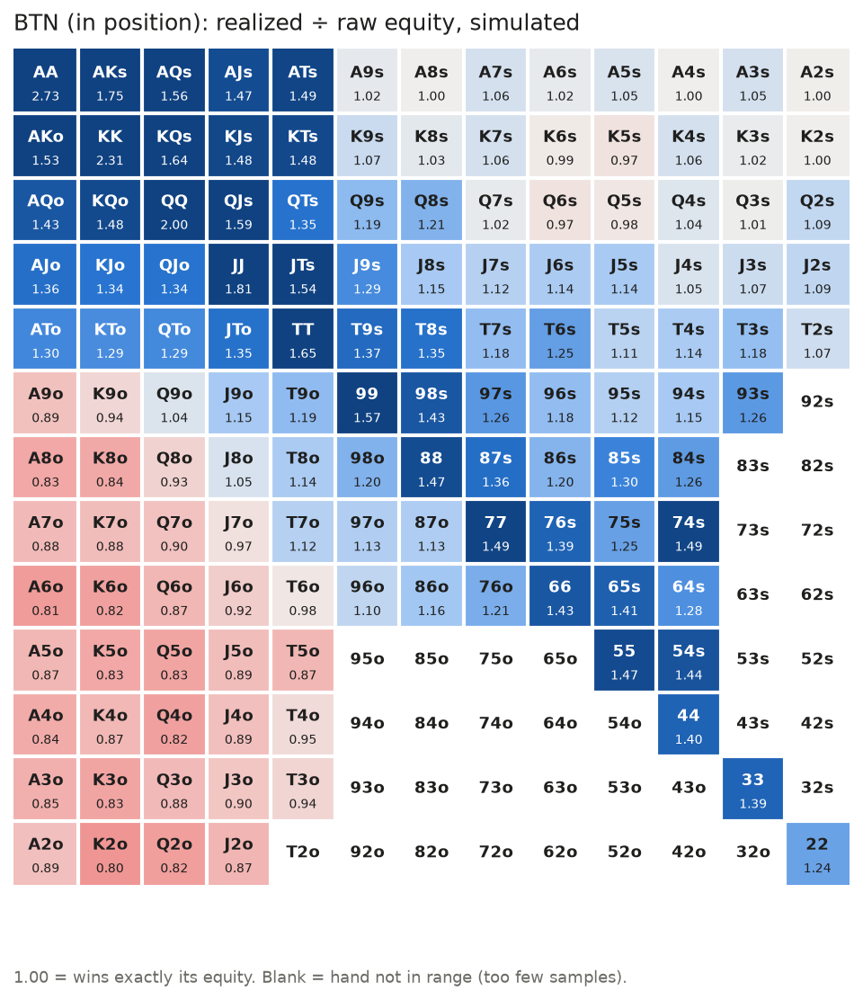
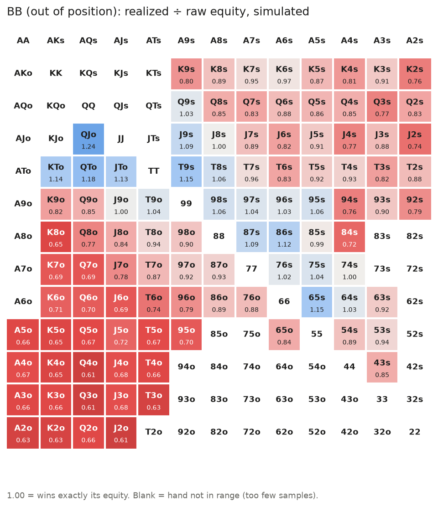

### 6c. How much do the rules matter? (`scripts/rule_sensitivity.py`)

| Rules | α | r_oop | BTN best open |
|---|---|---|---|
| baseline (bluff 1/3, bet 2/3 pot) | 1.35 | 0.78 | 2.50bb |
| never bluff | 1.70 | 0.95 | 2.25bb |
| bluff 2/3 of the time | 1.60 | 0.54 | 2.70bb |
| bet 1/2 pot | 1.05 | 0.89 | 3.10bb |
| bet full pot | 2.12 | 0.50* | 2.10bb |

\* hits the edge of the fit grid.

**Bet size is the biggest driver.** The rules call with any pair whatever the bet size,
so bigger bets just extract more from strong hands, making α larger and the best open
smaller. That the 2/3-pot baseline matches the solver calibration is encouraging,
but partly luck of the rule choice. The obvious next step is calling based on pot odds.

### 6d. Pot-odds calling and balanced bluffing

The 6b rules had two flaws: medium hands called any bet regardless of price, and
bettors bluffed a fixed 1/3 of their weak hands. `preflop/postflop.py` now defaults to:

* **Pot-odds calling:** facing a bet, call if your chance of beating the *bettor* is at least
  `bet / (pot + 2·bet)` (28.6% vs 2/3 pot). Strong hands always call. The chance comes from a
  learned table: hand strength (equity vs a random hand on this board, eval7 Monte Carlo)
  → how often hands that strong actually beat a bettor on that street. Example: on the river,
  a hand that beats 70% of random hands beats a bettor only ~30% of the time.
* **Balanced bluffing:** in each spot (BB leading / BTN after a check, by street), weak hands bluff
  just often enough that bluffs are `bet / (pot + 2·bet)` of all bets, the mix that leaves a
  caller indifferent. Learned rates are 4–9% of weak hands on the flop and 16–18% on the river.

Both are learned from two warm-up batches before the main batch.
(Pot-odds calling with the old fixed 1/3 bluffing ran away to α ≈ 2.9: callers adapt but
bettors don't, and the BTN gets more bluffing spots.)

| Rules | α | r_oop | BTN realizes / equity | BTN best open |
|---|---|---|---|---|
| **pot odds + balanced, 2/3 pot** | **1.25** | **0.92** | 62% / 58% | **2.75bb** (2.6–2.85) |
| pot odds + balanced, 1/2 pot | 1.13 | 0.93 | 61% / 58% | 3.00bb |
| pot odds + balanced, full pot | 1.66 | 0.88 | 67% / 58% | 2.25bb |
| pot odds + fixed bluff 1/3 | 2.91 | 0.69 | 80% / 58% | 1.75bb |
| old rules (call any pair, bluff 1/3) | 1.45 | 0.85 | 67% / 58% | 2.40bb |

Smarter rules give a smaller α (1.25) and a less extreme position penalty, so the best
open moves up to ~2.75bb, and 2.25bb costs 1.0bb/100. Bet size still matters, but less
(open 2.25–3.0bb across 1/2–full pot, vs 2.1–3.1bb with the old rules).

## Experiment 7: The Big Blind vs different raise sizes, preflop and postflop

`scripts/bb_study.py`. For each BTN open (2.0–3.5bb), realization is re-measured *at that
size* (solve → simulate with pot-odds / balanced rules → refit, 2 rounds), then the BB's
preflop and postflop play is summarized. α stays 1.26–1.36 at every size, so in this
range the open size barely changes how well hands realize.

### Preflop

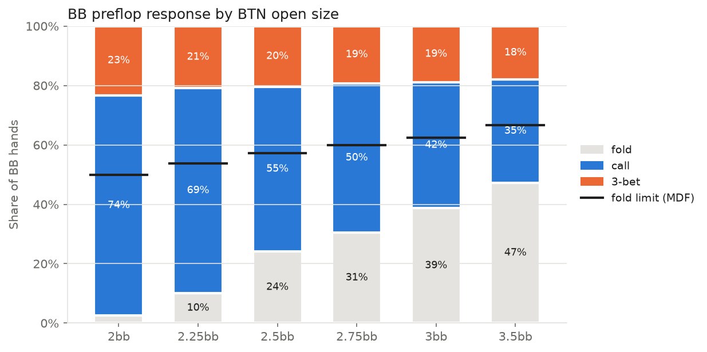

| BTN open | BB fold | call | 3-bet (to) | Fold limit (1 − MDF) |
|---|---|---|---|---|
| 2.0 | 2% | 74% | 23% (6.5bb) | 50% |
| 2.25 | 10% | 69% | 21% (7.3bb) | 54% |
| 2.5 | 24% | 55% | 20% (8.1bb) | 57% |
| 2.75 | 31% | 50% | 19% (9.6bb) | 60% |
| 3.0 | 39% | 42% | 19% (9.75bb) | 63% |
| 3.5 | 47% | 35% | 18% (11.4bb) | 67% |

* **Raise size mostly changes the BB's folds, not its 3-bets.** Each +0.25bb on the open moves
  ~5–10% of hands from call to fold, while the 3-bet share drifts only from 23% to 18%.
* **The best 3-bet stays ~3.25x the open** at every size.
* **The BB always defends more than MDF requires** (MDF = 1.5 / (open + 1): the BTN risks
  open − 0.5 to win 1.5). Calling has real value because the BB's hand still realizes ~90%
  of its equity out of position.
* Vs 2.25bb the BB folds only 11 hands (72o, 93o, 83o-style trash). Vs 3.0bb it folds most
  weak offsuit hands and low suited gappers (T2s–T4s, 92s–95s, 82s–85s, 72s–74s, 62s–64s, 52s–54s).

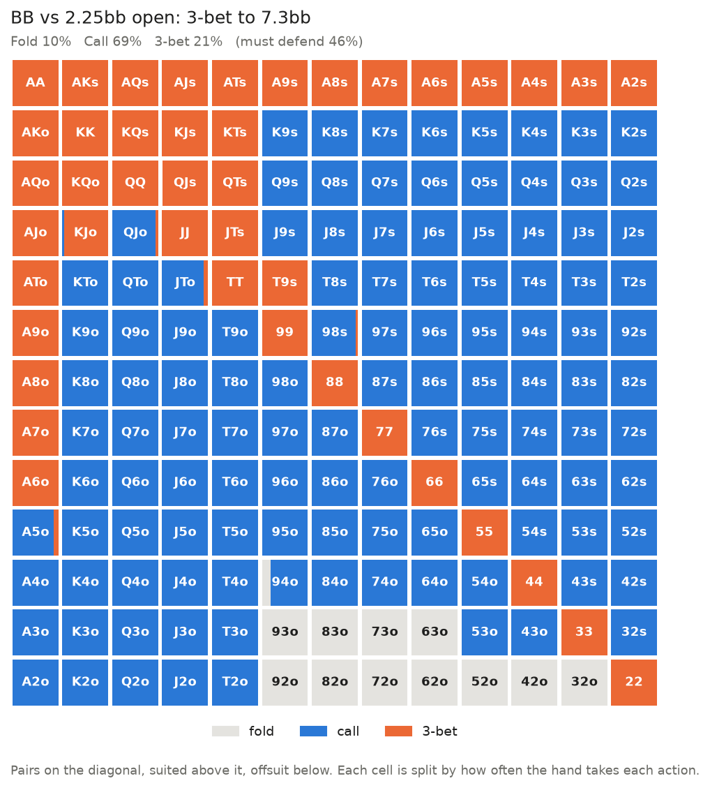

### Postflop (BB-called pots, simulated)

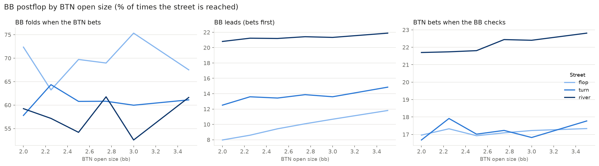
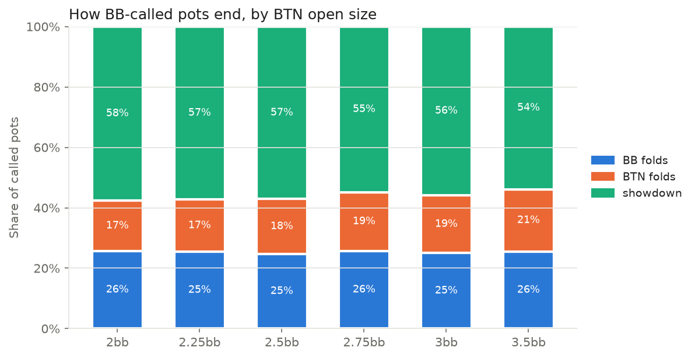

* **The BB realizes ~90% of its equity** (0.89–0.91) at every open size.
* **Called pots end the same way regardless of open size:** BB folds ~25%, BTN folds 17–21%,
  showdown 54–58%.
* **The BB leads more as the open grows** (flop leads 8% → 12%). Its calling range is tighter and
  stronger, so it flops more strong hands. River leads are steady at ~21%.
* **The BB folds 55–75% when the BTN bets.** That's correct against these rules: a balanced
  BTN betting range is ~71% value, so folding weak hands is right. Real players c-bet much
  more widely, so the BB should fold less.
* **BB bluffs work 54–61% of the time** (more often vs bigger opens).
* **Calling beats folding by +0.44 to +0.56bb per called hand.** The BB loses ~0.5bb on
  average postflop, but folding loses 1bb.

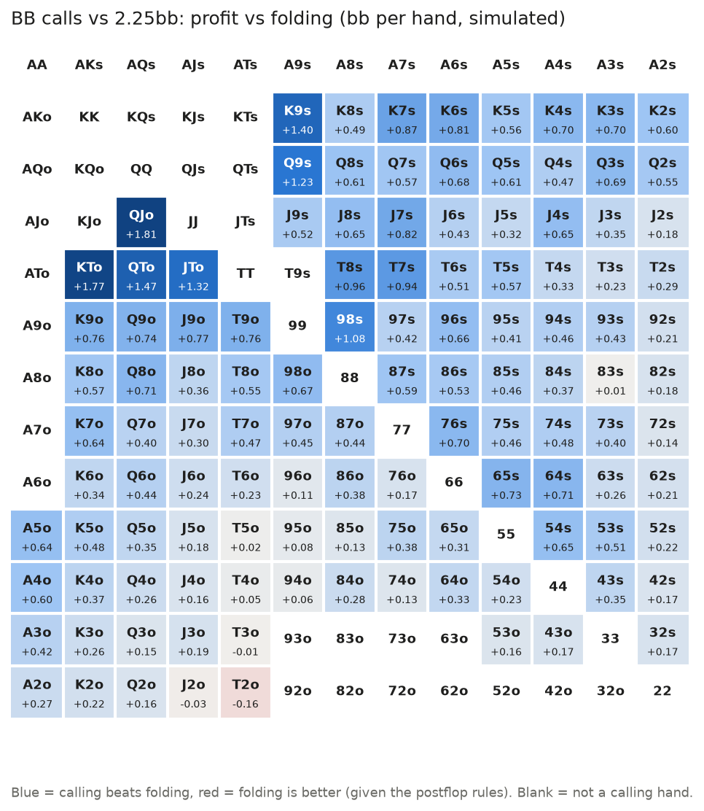

Per hand (vs 2.25bb): **broadway offsuit hands are the most profitable calls** (QJo +1.8, KTo +1.8,
QTo +1.5) along with high suited hands (K9s +1.4, Q9s +1.2). Weak offsuit hands barely break
even (T5o +0.02, T3o −0.01, J2o −0.03, T2o −0.16): those are the next folds as the open grows.
Vs 3.0bb the worst calls (Q2o −0.21, J5o −0.08, K2o −0.03) are already losing.

## Experiment 8: If the BB always checks, what does the Button c-bet, and when should the BB check-raise?

`scripts/cbet_study.py` + `preflop/flopgame.py`. BTN opens 2.25bb, BB calls (ranges from the
preflop solver). On the flop:

```
BB:  always checks
BTN: check | c-bet 1/3 pot
BB:  fold | call | check-raise to 3x the c-bet
BTN: fold | call                      (after a check-raise)
```

Turn and river use the pot-odds / balanced rules. **No flop decision is hand-written.** Each is
learned per (board texture, hand bucket) with CFR+ and Monte Carlo rollouts: every hand's flop
lines are all played to the end, the value of each option is averaged per texture × bucket, and
options that would have done better get played more next round (60 rounds, then 800k hands).

* **Hand buckets:** two pair+, overpair, top pair T+ kicker, top pair weak kicker, weaker pair,
  draw (flush draw / open-ender), two overcards, air.
* **Board texture:** high card (A / K / Q-J / T-or-lower) × paired × suits (rainbow / two-tone /
  monotone) × connected (three ranks within a 5-card span).

### Overall

| BTN c-bets | BB folds / calls / check-raises vs a c-bet | BTN calls a check-raise |
|---|---|---|
| 58% of flops | 32% / 50% / 18% | 80% |

### The Button's c-bet range

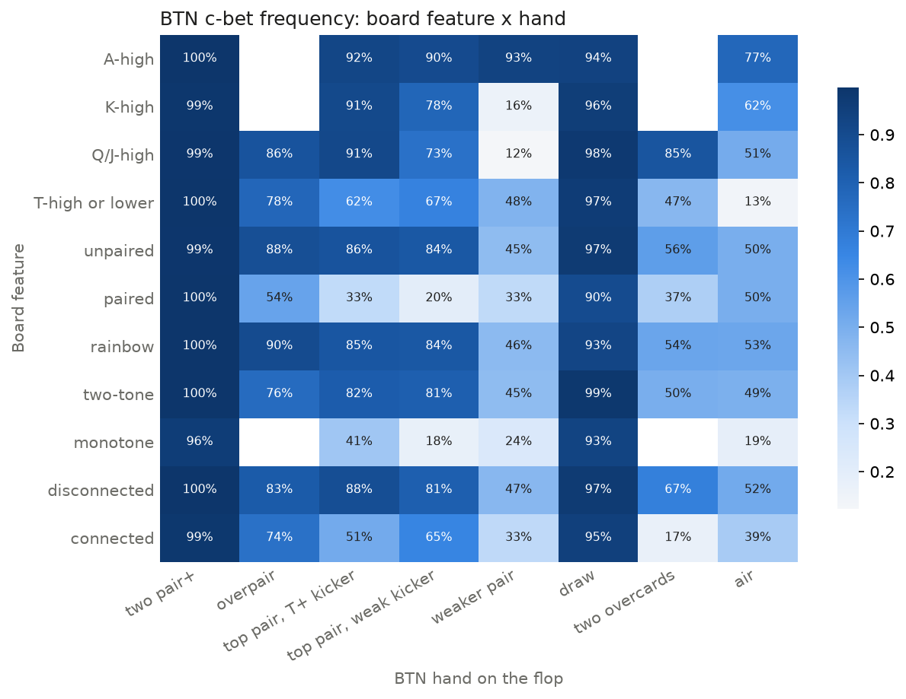

* **Value and draws always bet:** two pair+ 99%, draws 96%, overpairs 80%, top pair 78–81%.
* **Weak pairs mostly check** (44%), keeping the pot small with showdown value.
* **Air bets half the time overall, but it depends on the board.** 77% on A-high flops, 62% K-high,
  51% Q/J-high, only 13% on T-high-or-lower. High boards favor the BTN's range (it has more
  big cards after raising preflop); low, connected boards favor the BB's wider calling range.
* **By texture:** c-bets 85% on A-high flops vs 43% on T-high-or-lower; 46% on connected
  boards and 44% on monotone boards vs ~60% elsewhere.

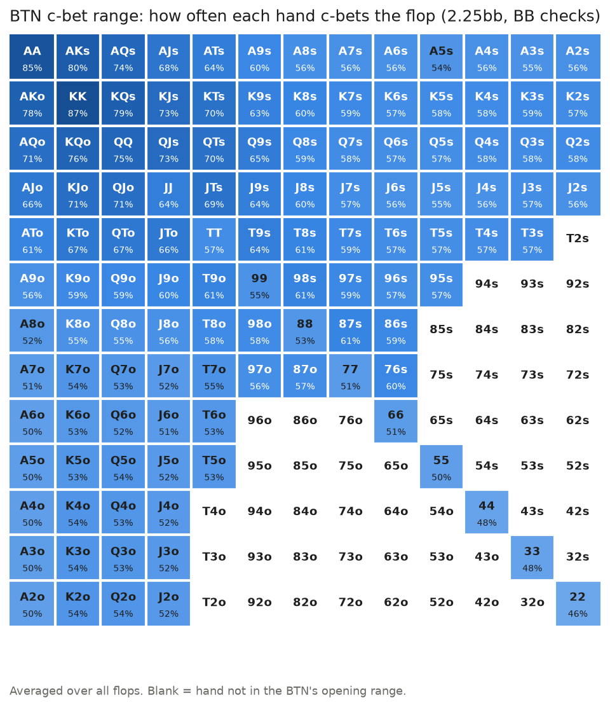

### When should the BB check-raise?

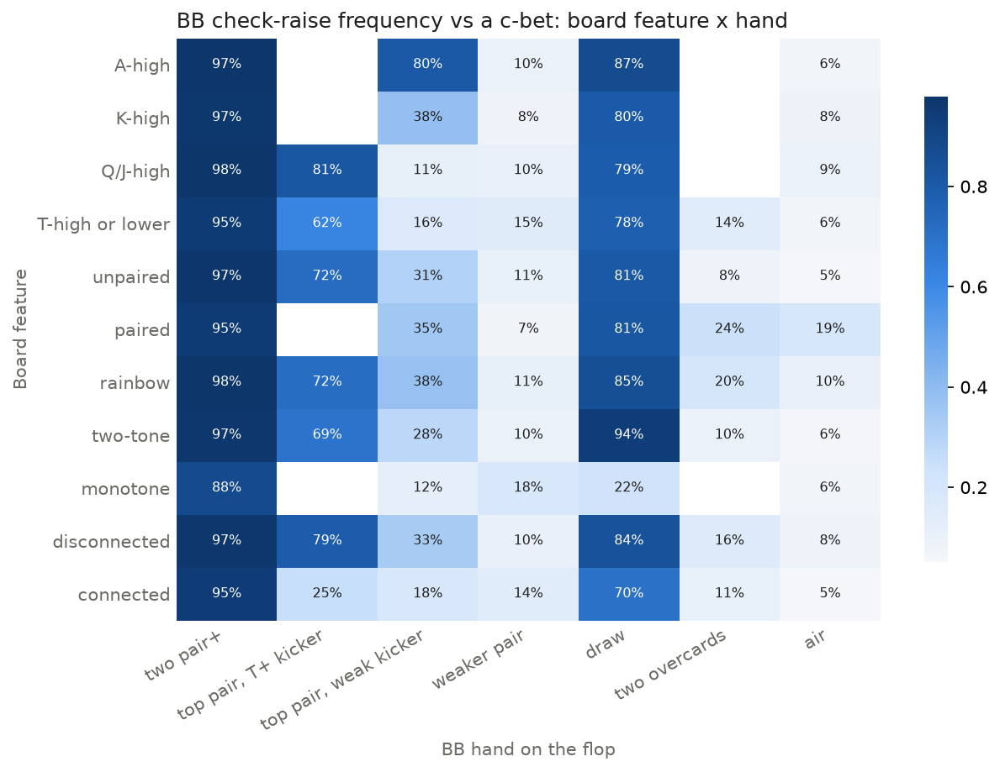

* **By hand:** two pair+ 97% (value), draws 81% (semi-bluff), top pair T+ kicker 67%, top pair
  weak kicker 31%. Weaker pairs and overcards mostly *call* (86% / 80%). Air folds 51% and
  check-raises as a bluff 7%.
* **By board, the BB check-raises most on boards that favor it:**
  * paired boards 27% vs 17% unpaired
  * T-high-or-lower 22% vs A-high 15%
  * top textures: paired low/middle boards and low connected boards (26–31%)
* **It check-raises least on A-high boards** (12–14%), where the BTN's range is strongest.
* **Texture changes which hands raise:**
  * top pair T+ kicker raises 80% on disconnected boards but only 22% on connected ones
    (too many better hands and draws around)
  * draws raise 94% on two-tone boards but only 20% on monotone ones (a flush draw on a
    monotone board is weaker)
  * air bluff-raises more on paired boards (18% vs 5%)

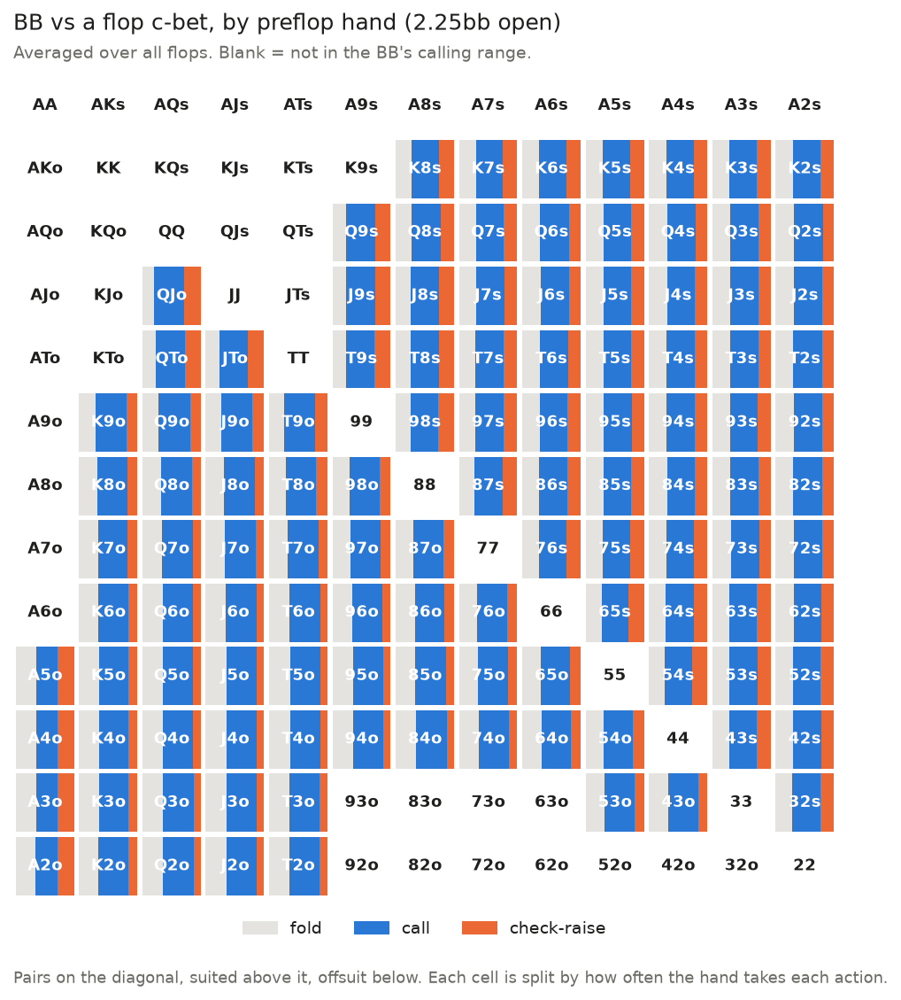

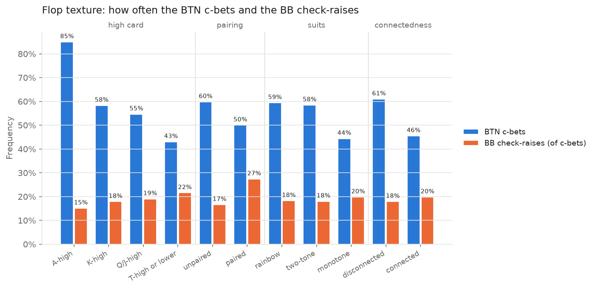

## Experiment 9: The BB study with a Button that bets more

`python scripts/bb_study.py cbet` reruns experiment 7 with the learned flop from experiment 8:
the BB checks the flop, and the BTN's c-bets and the BB's fold / call / check-raise are
learned at every open size (~18 min on an idle machine; each size is saved as it finishes).

### Preflop

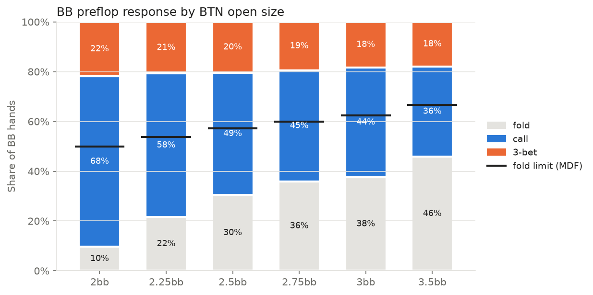

| BTN open | BB fold / call / 3-bet (BTN bets more) | rules-only BTN (exp. 7) | 3-bet to | BB realization (exp. 7) |
|---|---|---|---|---|
| 2.0 | 10% / 68% / 22% | 2% / 74% / 23% | 7.0bb (3.5x) | 0.82 (0.89) |
| 2.25 | 22% / 58% / 21% | 10% / 69% / 21% | 7.9bb (3.5x) | 0.83 (0.90) |
| 2.5 | 31% / 49% / 20% | 24% / 55% / 20% | 8.75bb (3.5x) | 0.83 (0.90) |
| 2.75 | 36% / 45% / 20% | 31% / 50% / 19% | 10.3bb (3.75x) | 0.83 (0.90) |
| 3.0 | 38% / 44% / 18% | 39% / 42% / 19% | 11.25bb (3.75x) | 0.84 (0.90) |
| 3.5 | 46% / 36% / 18% | 47% / 35% / 18% | 13.1bb (3.75x) | 0.85 (0.91) |

* **A Button that c-bets often cuts the BB's realization from ~0.90 to ~0.83** (α ≈ 1.35, r_oop 0.74–0.81).
* **The BB should fold more vs small opens:** +8 to +12 percentage points at 2.0–2.25bb. The gap
  closes by 3.0bb, where the BB's calling range is already tight.
* **The BB 3-bets bigger:** ~3.5–3.75x the open instead of ~3.25x. Taking the pot preflop is
  worth more when calling means facing frequent c-bets out of position.
* **The 3-bet share is unchanged** (22% → 18% as the open grows), and the BB still defends
  more than MDF at every size.
* **Calling still beats folding** by +0.43 to +0.49bb per called hand.

### Postflop

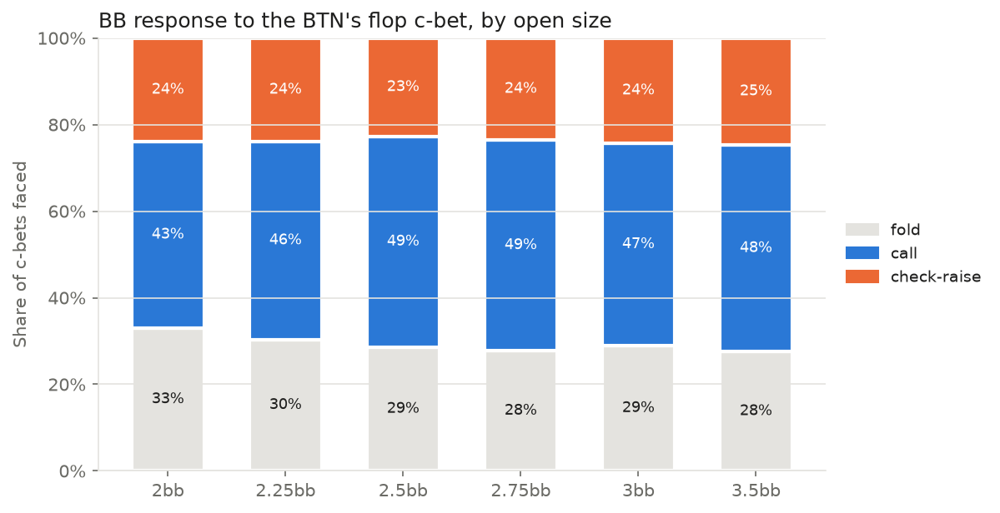

| BTN open | BTN c-bets | BB fold / call / check-raise vs c-bet | BTN calls a check-raise |
|---|---|---|---|
| 2.0 | 54% | 33% / 43% / 24% | 83% |
| 2.25 | 53% | 30% / 46% / 24% | 82% |
| 2.5 | 50% | 29% / 49% / 23% | 84% |
| 2.75 | 48% | 28% / 49% / 24% | 81% |
| 3.0 | 46% | 29% / 47% / 24% | 81% |
| 3.5 | 44% | 28% / 48% / 25% | 82% |

* **The bigger the open, the less the BTN c-bets** (54% → 44%). The BB's calling range gets
  tighter and stronger, so fewer flops favor the BTN.
* **The BB's answer to a c-bet barely depends on the open:** fold ~28–33%, check-raise ~24%.
  It folds slightly less vs bigger opens, because its range is stronger.
* **Called pots:** BB folds ~28–33%, BTN folds ~17%, showdown ~51–54%. That's more BB folds and
  fewer showdowns than with the rules-only BTN.

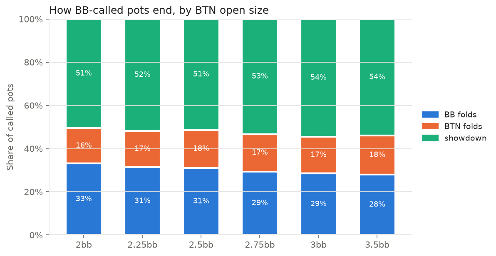

## Next steps

1. Add equity realization (IP realizes > 100%, OOP < 100%) and compare to published solver charts.
2. Model the gap between this model and solver frequencies with hand features (suited, connected, high card).
3. Sweep stack depth (10 → 200bb) and 3-bet size.
4. Multiway: rank hands by equity vs 1–8 random opponents (87s rises, K9o falls).
